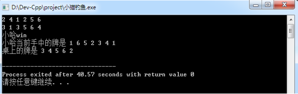
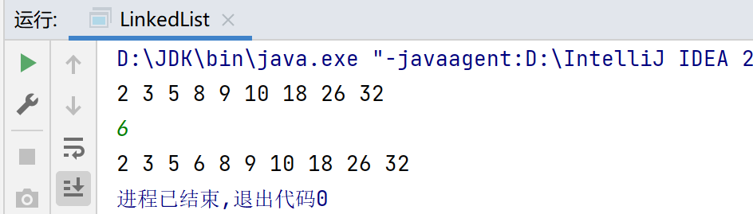

## **数据结构与算法**

### **一、排序**

#### **Ⅰ、简化版的桶排序**

**问题描述** ：将同学们的分数从低到高进行排序，总共有5个同学，分别考了5 分、 3 分、5 分、 2 分和 8 分（满分是 10 分）。

**时间复杂度**：O(M+N)，M为桶的个数，N为待排序数的个数

```c
#include<stdio.h>
int main()
{
    int a[11],i,j,t;
    for(i=0;i<=10;i++)
    {
        a[i]=0;//初始化为0
    }
    for(i=1;i<=5;i++)//循环读入5个数
    {
        scanf("%d",&t);//把每个数读到变量t中
        a[t]++;//进行计数
    }
    for(i=0;i<=10;i++)//以次判断a[0]~a[10]
    {
        for(j=1;j<=a[i];j++)
        {
            printf("%d",i);
        }
    }
    getchar();getchar();
    //getchar();相当于system("pause");
    return 0;
}
```

---

#### **Ⅱ、冒泡排序**

**基本思想**：每次比较两个相邻的元素，如果它们的顺序错误就把它们交换。

**时间复杂度**：O(N^2^)

```c
#include<stdio.h>
int main()
{
    int a[100],i,j,t,n;
    scanf("%d",&n);//输入一个数n，表示接下来有n个数
    for(i=1;i<=n;i++)//循环读入n个数到数组a中
    {
        scanf("%d",&a[i]);
    }
    //冒泡排序的核心部分
    for(i=1;i<=n-1;i++)//n个数排序，只用进行n-1趟
    {
        for(j=1;j<=n-1;j++)
        {
            if(a[j]<a[j+1])//比较大小并交换
            {
                t=a[j];a[j]=a[j+1];a[j+1]=t;
            }
        }
    }
    for(i=1;i<=n;i++)//输出结果
    {
        printf("%d",a[i]);
    }
    getchar();getchar();
    return 0;
}
```

运用结构体使分数与人名关联起来

```C
#include <stdio.h>
struct student
{
	char name[21];
	char score;
};//这里创建了一个结构体用来存储姓名和分数
int main()
{
	struct student a[100],t;
	int i,j,n;
	scanf("%d",&n); //输入一个数n
	for(i=1;i<=n;i++) //循环读入n个人名和分数
		scanf("%s %d",a[i].name,&a[i].score);
		//按分数从高到低进行排序
	for(i=1;i<=n-1;i++)
	{
		for(j=1;j<=n-i;j++)
		{
			if(a[j].score<a[j+1].score)//对分数进行比较
				{ t=a[j]; a[j]=a[j+1]; a[j+1]=t; }
		}
	}
	for(i=1;i<=n;i++)//输出人名
		printf("%s\n",a[i].name);
	getchar();getchar();
	return 0;
}

```

---

#### **Ⅲ、快速排序**

**算法思路**：首先在这个序列中选择一个基准数temp，先从右往左找一个小于 temp的数，再从左往右找一个大于 temp 的数，然后交换它们。这里用两个变量 i 和 j代表两个哨兵，分别指向序列最左边和最右边。右边的哨兵j先出动，找到小于基准数的数之后停下，然后左边的哨兵i找到大于基准数的数之后停下，两两交换。直到两个哨兵碰头，再将基准数归位。接下来继续处理左边的，再继续处理右边的这是一个递归调用函数的过程。

**时间复杂度**：O(NlogN)

```c
#include<stdio.h>
int a[101],n;//定义全局变量，这两个变量需要在子函数中使用
void quicksort(int left,int right)
{
    int i,j,t,temp;
    if(left>right)//作用：当数列中的temp为最小数时触发
    {return;}
    temp=a[left];//temp中存的就是基准数
    i=left;
    j=right;
    while(i!=j)
    {
        //顺序很重要，要先从右往左找
        while(a[j]>=temp && i<j)
        {j--;}
        //再从左往右找
        while(a[i]<=temp && i<j)
        {i++;}
        //交换两个数再数组中的位置
        if(i<j)//哨兵i和哨兵j没有相遇时
        {
            t=a[i];
            a[i]=a[j];
            a[j]=t;
        }
    }
    //最终将基准数归位，此时i=j
    a[left]=a[j];
    a[j]=temp;
    quicksort(left,i-1);//继续处理左边，这里是一个递归的过程
    quicksort(i+1,right);
    return 0;
}
int main()
{
    int i,j;
    //读入数据
    scanf("%d",&n);
    for(i=1;i<=n;i++)
    {
        scanf("%d",&a[i]);
    }
    quicksort(1,n);//快速排序调用
    //输出排序后的结果
    for(i=1;i<=n;i++)
    {
        printf("%d",a[i]);
    }
    getchar();getchar();
    return 0;
}
```

##### **改编《明明的随机数》**

小哼的学校要建立一个图书角，老师派小哼去找一些同学做调查，看看同学们都喜欢读哪些书。小哼让每个同学写出一个自己最想读的书的ISBN号（你知道吗？每本书都有唯一的ISBN号，不信话你去找本书翻到背面看看）。当然有一些好书会有很多同学都喜欢，这样就会收集到很多重复的ISBN号。小哼需要去掉其中重复的ISBN号，即每个ISBN号只保留一个，也就说同样的书只买一本（学校真是够抠门的）。然后再把这些ISBN号从小到大排序，小哼将按照排序好的ISBN号去书店去买书。请你协助小哼完成“去重”与“排序”的工作。

输入格式:

输入有2行，第1行为一个正整数，表示有n个同学参与调查（n<=100）。第2行有n个用空格隔开的正整数，为每本图书的ISBN号（假设图书的ISBN号在1~1000之间）。
输出格式:

输出也是2行，第1行为一个正整数k，表示需要买多少本书。第2行为k个用空格隔开的正整数，为从小到大已排好序的需要购买的图书ISBN号。
提示:

改编自全国青少年信息学奥林匹克联赛（NOIP2006）普及组第一题《明明的随机数》。
限制:

每个测试点1秒
样例 1 :

输入:

```bash
10
20 40 32 67 40 20 89 300 400 15
```

输出:

```bash
8
15 20 32 40 67 89 300 400
```

**思路**：先从小到大排序(快速排序算法)，再去重

```c++
#include<iostream>
#include"global1.h"//自定义头文件内容为：int a[101],i,j;作用定义全局变量
using namespace std;
void quicksort(int left, int right);
int main()
{	
	int k = 1;//k用于去重计数
	cin >> n;
	for (i = 1; i <= n; i++)
	{
		cin >> a[i];
	}
	quicksort(1, n);
	for (i = 2; i <= n; i++)//去重计数,i=2防止a[1]与a[0]比较
	{	
		if (a[i] != a[i - 1])
		{
			k++;
		}
		
	}
	cout << k << "\n";
	cout << a[1]<<" ";
	for (i = 2; i <= n; i++)//去重输出
	{
		if (a[i] != a[i - 1])
		{
			cout << a[i] << " ";
		}
		
	}
	return 0;
}
void quicksort(int left, int right)//快速排序函数
{	
	int temp , t;
	if (left > right)
	{
		return;
	}
	i = left;
	j = right;
	temp = a[left];
	while (i != j)
	{
		while (a[j] >= temp && i < j)
		{
			j--;
		}
		while (a[i] <= temp && i < j)
		{
			i++;
		}
		if (i < j)
		{
			t = a[j];
			a[j] = a[i];
			a[i] = t;
		}
	}
	a[left] = a[i];
	a[i] = temp;
	quicksort(left, i - 1);
	quicksort(i + 1, right);
	return;
}
```

---

### **二、队列(先进先出First In First Out ,FIFO)**

**问题**：给定加密过的一串数(6 3 1 7 5 8 9 2 4)解密小哈的QQ号，规则：首先将第一个数删除，紧接着将第二个数放到这串数的末尾，再将第三个数删除并将第四个数放到这串数的末尾，再将第五个数删除……直到剩下最后一个数，将最后一个数也删除。按照删除的顺序，把删除的数连在一起就是小哈的QQ号了。

**思路**：

data[]数组从data[1]开始使用

head用来记录队列的队首（第一位数）

tail用来记录队列的队尾（最后一位数）的下一个位置

```C
#include<stdio.h>//使用结构体来实现的队列操作
struct queue 
{
    int data[100];//队列的主体，用来储存内容
    int head;//队首
    int tail;//队尾
};
int main()
{
    struct queue q;
    int i;
    //初始化队列
    q.head = 1;
    q.tail = 1;
    for(i=1;i<=9;i++)
    {
        //依次向队列插入9个数
        scanf("%d",&q.data[q.tail]);
        q.tail++;
    }
    while(q.head<q.tail)//当队列不为空时执行循环
    {
        //打印队首并将队首出队
        printf("%d",q.data[q.head]);
        q.head++;
        //先将新队首的数添加到队尾
        q.data[q.tail]=q.data[q.head];
        q.tail++;
        //再将队首出队
        q.head++;
    }
    getchar();getchar();
    return 0;
}

```

---

### **三、栈(后进先出)**

**问题**：解密回文，回文字符串是指从左到右读和从右到左读完全相同的字符串。

​			"xyzyx"，"ahha"，"aha"均是一个回文字符串，如"ahah"等则不属于回文。

**思路**：通过栈比较字符串的前半段与后半段

```c
#include<stdio.h>
#include<string.h>
int main()
{
    char a[101],s[101];
    int i,len,mid,next,top;
    
    gets(a);//读入一行字符串
    len=strlen(a);//求字符串的长度
    mid=len/2-1;//求字符串的中点
    
    top=0;//栈的初始化
    //将mid前的字符依次入栈,从s[1]开始使用
    for(i=0;i<=mid;i++)
    {
        s[++top]=a[i];//相当于top++;s[top]=a[i];
    }
    
    //判断字符串的长度是基数还是偶数，并找出需要进行字符匹配的起始下标
    if(len%2==0)
    {
        next=mid+1;
    }
    else
    {
        next=mid+2;
    }
    
    //开始匹配
    for(i=next;i<=len-1;i++)
    {
        if(a[i]!=s[top])
        {
            break;
        }
        top--;
    }
    
    //如果top值为0，则说明栈内所有的字符串都被一一匹配了
    if(top==0)
    {
        printf("YES");
    }
    else
    {
        printf("NO");
    }
    getchar();getchar();
    return 0;
}
```

若栈s[ ]从s[0]开始使用则：

```c++
#include<iostream>
#include<cstring>
using namespace std;
int main()
{
	char a[101],s[101];
	int top=0,i,next,len,mid;
	/*for(i=0;i<=100;i++)
	{
		cin>>a[i];
		if(cin.get()=='\n')
		{
			break;
		}
	}*/
	gets(a);
	len = strlen(a);
	mid = len/2 - 1;
	for(i=0;i<=mid;i++)
	{
		s[top]=a[i];
		top++;//以s[0]为栈底，此时top指向栈顶的上一个单元，非标准栈
	}
	if(len%2==0)
	{
		next=mid+1;
	}
	else
	{
		next=mid+2;
	}
	top--;//要操作栈顶的数据，所以将top指向栈顶
	for(i=next;i<=len-1;i++)
	{
		if(a[i]==s[top])
		{
			top--;
		}
		else
		{
			break;
		}
	}
	if(top==-1)
	{
		cout<<"YES";
	}
	else
	{
		cout<<"NO";
	}
	system("pause");
	return 0; 
 } 
```

---

##### **小猫钓鱼**

纸牌游戏---小猫钓鱼，游戏规则：将一副扑克牌平均分成两份，每人拿一份。小哼先拿出手中第一张牌放在桌面上，然后小哈也拿出手中的第一张牌，并放在小哼刚打出的牌的上面，两人交替出牌。出牌时，如果某人打出的牌与桌面上某张牌的牌面相同，即可将两张相同的牌及中间夹着的牌全部那走，并依次放在自己手中牌的末尾。当任意一人手中的牌全部出完时，游戏结束。假设小哼手中有6张牌顺序为：2	4	1	2	5	6，小哈手中的牌：3	1	3	5	6	4，且牌面只有1~9。

**思路**：将出牌动作看成**出队**，赢牌就是**入队**。桌面相当于一个**栈**。即需要两个**队列**和一个**栈**模拟整个游戏。使用结构体实现**队列**和**栈**。

```c
#include<stdio.h>
struct queue//创建队列
{
    int data[1000];
    int head;
    int tail;
};
struct stack//创建栈
{
    int data[10];
    int top;
};
int main()
{
    struct queue q1,q2;
    struct stack s;
    int book[10];
    int i,t;
    //初始化队列
    q1.head=1;q1.tail=1;
    q2.head=1;q2.tail=1;
    //初始化栈
    s.top=0;
    //初始化用来标记的数组，用来标记哪些牌已经在桌上
    for(i=1;i<=9;i++)
    {
        book[i]=0;
    }
    //依次向队列插入6个数
    //小哼手上的6张牌
    for(i=1;i<=6;i++)
    {
        scanf("%d",&q1.data[q1.tail]);
        q1.tail++;
    }
    //小哈手上的6张牌
    for(i=1;i<=6;i++)
    {
        scanf("%d",&q2.data[q2.tail]);
            q2.tail++;
    }
    while(q1.head<q1.tail&&q2.head<q2.tail)//当队列不为空的时候执行循环
    {
        t=q1.data[q1.head];//小哼出一张牌
        //判断小哼当前打出的牌是否能赢牌
        if(book[t]==0)//表明桌面没有牌面为t的牌
        {
            //小哼此轮没有赢牌
            q1.head++;//小哼以打出一张牌，所以要把打出的牌出队
            s.top++;
            s.data[s.top]=t;//再把打出的牌放到桌面上，即入栈
            book[t]=1;//标记桌上现在已经有牌面为t的牌
        }
        else
        {
            //小哼此轮可以赢牌
            q1.head++;//小哼已经打出一张牌，所以要把打出的牌出队
            q1.data[q1.tail]=t;//紧接着把打出的牌放到手中牌的末尾 
            q1.tail++;
            while(s.data[s.top]!=t)//把桌上可以赢得的牌依次放到手中牌的末尾
            {
                book[s.data[s.top]]=0;//取消标记
                q1.data[q1.tail]=s.data[s.top];//依次放入队尾
                q1.tail++;
                s.top--;
            }
            //收回桌上牌面为t的牌
            book[s.data[s.top]]=0;
            q1.data[q1.tail]=s.data[s.top];
            q1.tail++;
            s.top--;
        }
        if(q1.head==q1.tail)//小哼手中牌如果已经打完，游戏结束
        {
            break;
        }
        t=q2.data[q2.head];//小哈出一张牌
        //判断小哈当前打出的牌是否能赢牌
        if(book[t]==0)
        {
            //小哈此轮没有赢牌
            q2.head++;//小哈已经打出一张牌，所以要把打出的牌出队
            s.top++;
            s.data[s.top]=t;//再把打出的牌放到桌上，即入栈
            book[t]=1;//标记桌上现在已经有牌面为t的牌
        }
        else
        {
            //小哈此轮可以赢牌
            q2.head++;//小哈已经打出一张牌，所以要把打出的牌出队
            q2.data[q2.tail]=t;//紧接着把打出的牌放到手中牌的末尾
            q2.tail++;
            whie(s.data[s.top]!=t)//把桌上可以赢得的牌依次放到手中牌的末尾
            {
                book[s.data[s.top]]=0;//取消标记
                q2.data[q2.tail]=s.data[s.top];//依次放入队尾
                q2.tail++;
                s.top--;
            }
            //收回桌上牌面为t的牌
            book[s.data[s.top]]=0;
            q2.data[q2.tail]=s.data[s.top];
            q2.tail++;
            s.top--;
         }
    }
    if(q2.head==q2.tail)
    {
        printf("小哼win\n");
        printf("小哼当前手中的牌是")；
        for(i=q1.head;i<=q1.tail-1;i++)
        {
            printf("%d",q1.data[i]);
        }
        if(s.top>0)
        {
            printf("\n桌上的牌是");
            for(i=1;i<=s.top;i++)
            {
                printf("%d",s.data[i]);
            }
        }
        else
        {
            printf("\n桌上已经没有牌了");
        }
    }
    else
    {
     	printf("小哈win\n");
        printf("小哈当前手中的牌是");
        for(i=q2.head;i<=q2.tail-1;i++)
        {
            printf("%d",q2.data[i]);
        }
        if(s.top>0)
        {
            printf("\n桌上的牌是");
            for(i=1;i<=s.top;i++)
            {
                printf("%d",s.data[i]);
            }
        }
        else
        {
            printf("\n桌上已经没有牌了");
        }   
    }
    getchar();getchar();
    return 0;
}
```

输入以下数据进行验证

```bash
2 4 1 2 5 6
3 1 3 5 6 4
```

运行结果



---

### **四、链表**

##### **链表的创建，插入，删除，查找**

```java
public class LinkedList<T>{
    private class Node{
        T data;
        Node next;
        public Node(T data){
            this.data = data;
        }
    }
    public Node head;
    public Node last;
    public int size;

    /**
     * 查找元素
     *
     * @param index 位置
     * @return {@link T}
     */
    public Node get(int index){
        if(index<0 || index>=size){
            throw new IndexOutOfBoundsException("索引超出链表范围。");
        }
        Node tmp = head;
        for (int i = 0; i < index; i++) {
            tmp = tmp.next;
        }
        return tmp;
    }

    /**
     * 输出链表
     */
    public void output(){
        Node tmp = head;
        while(tmp != null){
            System.out.println(tmp.data);
            tmp = tmp.next;
        }
    }
    /**
     * 插入元素
     *
     * @param index 位置
     * @param data  数据
     */
    public void insert(int index,T data){
        if(index<0 || index>size){
            throw new IndexOutOfBoundsException("索引超出链表范围。");
        }
        Node insertNode = new Node(data);
        if(size == 0){
            //空链表
            head = insertNode;
            last = insertNode;
        }
        /*插入头部*/
        else if(index == 0){
            insertNode.next = head;
            head = insertNode ;
        }
        /*插入尾部*/
        else if(index == size){
            last.next = insertNode;
            insertNode.next = null;
            last = insertNode;
        }
        /*插入中间*/
        else{
            Node prevNode = get(index-1);
            insertNode.next = prevNode.next;
            prevNode.next = insertNode;
        }
        size++;
    }
	/**
     * 删除节点
     *
     * @param index 位置
     * @return {@link Node}
     */
    public Node remove(int index){
        if(index<0 || index>=size){
            throw new IndexOutOfBoundsException("索引超出链表范围。");
        }
        Node removeNode = null;
        /*删除尾节点*/
        if(index == size-1){
            Node prevNode = get(index-1);
            removeNode = prevNode.next;
            prevNode.next = null;
            last = prevNode;
        }
        /*删除头节点*/
        else if(index == 0){
            removeNode = head;
            head = head.next;
        }
        /*删除中间节点*/
        else{
            Node prevNode = get(index-1);
            removeNode = prevNode.next;
            prevNode.next = prevNode.next.next;
        }
        size--;
        return removeNode;
    }
```

##### **插入数字**

已有一串从小到大排好序的数2	3	5	8	10	18	26	32。现需要往这串数中插入6使其得到的新序列仍符合从小到大排序。

输入：

```bash
9
2 3 5 8 9 10 18 26 32
6
```

输出：

```bash
2 3 5 6 8 9 10 18 26 32
```

**思路**：若用数组则需要8和8后面的数都依次往后挪一位但时间复杂度高，因此使用链表。

Java题解：

```java
public static void main(String[] args) {
	LinkedList linkedList = new LinkedList<>();
    linkedList.insert(0,2);
    linkedList.insert(1,3);
    linkedList.insert(2,5);
    linkedList.insert(3,8);
    linkedList.insert(4,9);
    linkedList.insert(5,10);
    linkedList.insert(6,18);
    linkedList.insert(7,26);
    linkedList.insert(8,32);
    linkedList.output();
    System.out.println();
    int index = 0;
    for (int i = 0; i < linkedList.size; i++) {
        if((int)linkedList.get(i).data > 6){
            index = i ;
            break;
        }
    }
    linkedList.insert(index,6);
    linkedList.output();
}
```

运行结果



C++题解：

```c
#include<stdio.h>
#include<stdlib.h>
struct node//创建一个结构体用来表示链表的结点类型
{
    int data;//节点的数据
    struct node *next;//节点的下一个元素的指针
};
int main()
{
    struct node *head,*p,*q,*t;
    int i,n,a;
    scanf("%d",n);
    head=NULL;//头指针初始为空
    for(i=1;i<=n;i++)//循环读入n个数
    {
        scanf("%d",&a);
        //动态申请一个空间，用来存放一个结点，并用临时指针p指向这个结点
        p=(struct node *)malloc(sizeof(struct node));
        p->data=a;//将数据存储到当前结点的data域中
        p->next=NULL;//设置当前结点的后继指针指向空，也就是当前结点的下一个结点为空
        if(head==NULL)
        {
            head=p;//如果这是第一个创建的结点，则将头指针指向这个结点
        }
        else
        {
            q->next=p;//如果不是第一个创建的结点，则将上一个结点的后继指针指向当前结点
        }
        q=p;//指针q也指向当前结点
    }
    scanf("%d",&a);//读入待插入的数
    t=head;//从链表头部开始遍历
    while(t!=NULL)//当没有到达链表尾部的时候循环
    {
        if(t->next==NULL||t->next->data>a)
        //如果当前结点是最后一个节点或者下一个结点的值大于待插入数的时候插入
        {
            //动态申请一个空间存放新增结点
            p=(struct node *)malloc(sizeof(struct node));
            p->data=a;
            p->next=t->next;//新增结点的后继指针指向当前结点的后继指针所指向的结点
            t->next=p;//当前结点的后继指针指向新增结点
            break;//插入完毕退出循环
        }
        t=t->next;//继续下一个结点
    }
    //输出链表中所有数
    t=head;
    while(t!=NULL)
    {
        printf("%d",t->data);
        t=t->next;//继续下一个结点
    }
    getchar();getchar();
    return 0;
}
```


