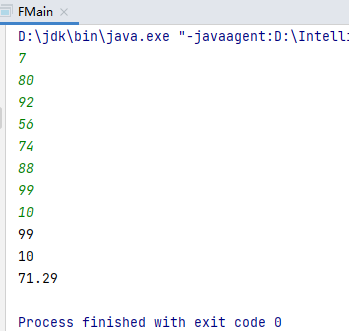

# **蓝桥杯**

## 2020广东省初赛第十一届蓝桥杯大赛软件类省赛

### **试题 A: 门牌制作**

```
【问题描述】
小蓝要为一条街的住户制作门牌号。
这条街一共有 2020 位住户，门牌号从 1 到 2020 编号。
小蓝制作门牌的方法是先制作 0 到 9 这几个数字字符，最后根据需要将字
符粘贴到门牌上，例如门牌 1017 需要依次粘贴字符 1、0、1、7，即需要 1 个
字符 0，2 个字符 1，1 个字符 7。
请问要制作所有的 1 到 2020 号门牌，总共需要多少个字符 2？
```

**解法一：**

思路：枚举1~2020的每个数字，将所有数字转换成一个字符串，再遍历字符串计算含有多少个字符2

```java
public class Main {
    public static void main(String[] args) {
        String str = null;
        int k=0;
        for(int i=1;i<=2020;i++){//枚举1~2020的每个数字，将所有数字转换成一个字符串
            str += String.valueOf(i);
        }
        int n=str.length();
        for(int j=0;j<n;j++){//遍历字符串计算含有多少个字符2,用k记录
            if(str.charAt(j)=='2'){
                k++;
            }
        }
        System.out.println(k);
    }
}
```

答案：624


---

### **试题 C: 蛇形填数**

```
【问题描述】
如下图所示，小明用从 1 开始的正整数“蛇形”填充无限大的矩阵。
1 2 6 7 15 ...
3 5 8 14 ...
4 9 13 ...
10 12 ...
11 ...
...
容易看出矩阵第二行第二列中的数是 5。请你计算矩阵中第 20 行第 20 列的数是多少？
```

**解法一：**

思路：补全小部分矩阵，发现规律，坐标（行，列）（0,0）=1，（1,1）=5，（2,2）=13，（3,3）=25，（4,4）=41，（5,5）=61......	1+**4**=5	5+**8**=13	13+**12**=25	25+**16**=41....

```
public class CMain {
    public static void main(String[] args) {
        int [] a =new int[21];
        int [] b=new int[20];
        a[1]=1;b[1]=4;
        for(int i=2;i<=19;i++){//b[]数组4,8,12,16,20....
            b[i]=b[i-1]+4;
        }
        for(int j=2;j<=20;j++){//a[]行列相同时的数组成的数组
            a[j]=b[j-1]+a[j-1];//数组a[j]的等于前一项a[j-1]与相同下标的数组b[j-1]的和
        }
        System.out.println(a[20]);
    }
}
```

**解法二：**

构造补全矩阵

```java
public class Main {
    public static void main(String[] args) {
        int [][] a = new int[40][40];//因为值在对角线中点处，二维数组的宽高至少要定义为40
        int n = 1, row = 0, col = 0;
        a[0][0] = 1;
        while(a[19][19]==0) {
            //右走
            a[row][++col] = ++n;
            //左下
            while(col!=0) {
                a[++row][--col] = ++n;
            }
            //下走
            a[++row][col] = ++n;
            //右上
            while(row!=0) {
                a[--row][++col] = ++n;
            }
        }
        System.out.println(a[19][19]);
    }
}
```

答案：761

---

### **试题 F: 成绩分析**

```
时间限制: 1.0s 内存限制: 512.0MB 本题总分：15 分
【问题描述】
小蓝给学生们组织了一场考试，卷面总分为 100 分，每个学生的得分都是
一个 0 到 100 的整数。
请计算这次考试的最高分、最低分和平均分。
【输入格式】
输入的第一行包含一个整数 n，表示考试人数。
接下来 n 行，每行包含一个 0 至 100 的整数，表示一个学生的得分。
【输出格式】
输出三行。
第一行包含一个整数，表示最高分。
第二行包含一个整数，表示最低分。
第三行包含一个实数，四舍五入保留正好两位小数，表示平均分。
【样例输入】
7
80
92
56
74
88
99
10
【样例输出】
99
10
71.29
【评测用例规模与约定】
对于 50% 的评测用例，1 ≤ n ≤ 100。
对于所有评测用例，1 ≤ n ≤ 10000。
```

**解法一：**

```java
import java.util.Scanner;

public class FMain {
    public static void main(String[] args) {
        Scanner sn = new Scanner(System.in);
        int n=sn.nextInt();
        int [] a =new int[n+1];
        for(int i=1;i<=n;i++){//将输入的数据放入数组
            Scanner sn1=new Scanner(System.in);
            a[i]=sn1.nextInt();
        }
        int max=a[1] , min=a[1] , sum=a[1] ; double avg=0.0;
        for(int j=2;j<=n;j++){
            if(max<a[j]){//查找数组中的最大数
                max=a[j];
            }
            if(min>a[j]){//查找数组中的最小数
                min=a[j];
            }
            sum=sum+a[j];//将数组中各数相加求和
        }
        avg=(double) sum/(double) n;//求平均数
        System.out.println(max+"\n"+min+"\n");
        System.out.printf("%.2f",avg);//四舍五入保留小数点后两位
    }
}
```

运行结果：



---

### 试题 G: 单词分析

```
【问题描述】
小蓝正在学习一门神奇的语言，这门语言中的单词都是由小写英文字母组
成，有些单词很长，远远超过正常英文单词的长度。小蓝学了很长时间也记不
住一些单词，他准备不再完全记忆这些单词，而是根据单词中哪个字母出现得
最多来分辨单词。
现在，请你帮助小蓝，给了一个单词后，帮助他找到出现最多的字母和这
个字母出现的次数。
【输入格式】
	输入一行包含一个单词，单词只由小写英文字母组成。
【输出格式】
	输出两行，第一行包含一个英文字母，表示单词中出现得最多的字母是哪
 个。如果有多个字母出现的次数相等，输出字典序最小的那个。
 第二行包含一个整数，表示出现得最多的那个字母在单词中出现的次数。
【样例输入】
lanqiao
【样例输出】
a
2
【样例输入】
longlonglongistoolong
【样例输出】
o
6
【评测用例规模与约定】
对于所有的评测用例，输入的单词长度不超过 1000。
```

**解法一：**

```java
public static void main(String[] args) {
    Scanner sn=new Scanner(System.in);
    String str=sn.next();
    String str1="abcdefghijklmnopqrstuvwxyz";
    int [] a=new int[26];
    int n=str.length();
    int max=0,num=0;
    for(int i=0;i<n;i++) {
        switch (str.charAt(i)) {
            case 'a' : a[0]++;break;
            case 'b' : a[1]++;break;
            case 'c' : a[2]++;break;
            case 'd' : a[3]++;break;
            case 'e' : a[4]++;break;
            case 'f' : a[5]++;break;
            case 'g' : a[6]++;break;
            case 'h' : a[7]++;break;
            case 'i' : a[8]++;break;
            case 'j' : a[9]++;break;
            case 'k' : a[10]++;break;
            case 'l' : a[11]++;break;
            case 'm' : a[12]++;break;
            case 'n' : a[13]++;break;
            case 'o' : a[14]++;break;
            case 'p' : a[15]++;break;
            case 'q' : a[16]++;break;
            case 'r' : a[17]++;break;
            case 's' : a[18]++;break;
            case 't' : a[19]++;break;
            case 'u' : a[20]++;break;
            case 'v' : a[21]++;break;
            case 'w' : a[22]++;break;
            case 'x' : a[23]++;break;
            case 'y' : a[24]++;break;
            case 'z' : a[25]++;break;
        }
    }
    for(int j=0;j<n;j++){
        if(max<a[j]){
            max=a[j];
            num=j;
        }
    }
    System.out.println(str1.charAt(num)+"\n"+max);
}
```

**解法二：**

```java
public static void main(String[] args) {
    Scanner scan = new Scanner(System.in);
    String word = scan.nextLine();
    int [] a = new int[26];

    for (int i = 0; i < word.length(); i++) {
        //最关键！根据字符与'a'的ASII码的差,定位数组的下标。
        a[word.charAt(i)-'a']++;
    }
    int n = a[0];
    int j = 0;
    //正序找数组中最大的数，保证有相同最大值时字典序最小
    for (int i=0; i < a.length; i++) {
        if(a[i]>n) {
            n = a[i];
            j = i;
        }
    }
    System.out.println((char)('a'+j));
    System.out.println(n);
    scan.close();
}
```

---

