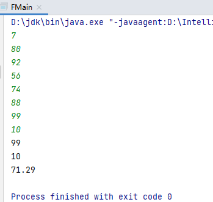

# 成绩分析

```
【问题描述】
小蓝给学生们组织了一场考试，卷面总分为 100 分，每个学生的得分都是
一个 0 到 100 的整数。
请计算这次考试的最高分、最低分和平均分。
【输入格式】
输入的第一行包含一个整数 n，表示考试人数。
接下来 n 行，每行包含一个 0 至 100 的整数，表示一个学生的得分。
【输出格式】
输出三行。
第一行包含一个整数，表示最高分。
第二行包含一个整数，表示最低分。
第三行包含一个实数，四舍五入保留正好两位小数，表示平均分。
【样例输入】
7
80
92
56
74
88
99
10
【样例输出】
99
10
71.29
【评测用例规模与约定】
对于 50% 的评测用例，1 ≤ n ≤ 100。
对于所有评测用例，1 ≤ n ≤ 10000。
```

**解法一：**

```java
import java.util.Scanner;

public class FMain {
    public static void main(String[] args) {
        Scanner sn = new Scanner(System.in);
        int n=sn.nextInt();
        int [] a =new int[n+1];
        for(int i=1;i<=n;i++){//将输入的数据放入数组
            Scanner sn1=new Scanner(System.in);
            a[i]=sn1.nextInt();
        }
        int max=a[1] , min=a[1] , sum=a[1] ; double avg=0.0;
        for(int j=2;j<=n;j++){
            if(max<a[j]){//查找数组中的最大数
                max=a[j];
            }
            if(min>a[j]){//查找数组中的最小数
                min=a[j];
            }
            sum=sum+a[j];//将数组中各数相加求和
        }
        avg=(double) sum/(double) n;//求平均数
        System.out.println(max+"\n"+min+"\n");
        System.out.printf("%.2f",avg);//四舍五入保留小数点后两位
    }
}
```

运行结果：

