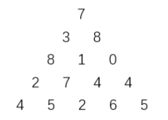
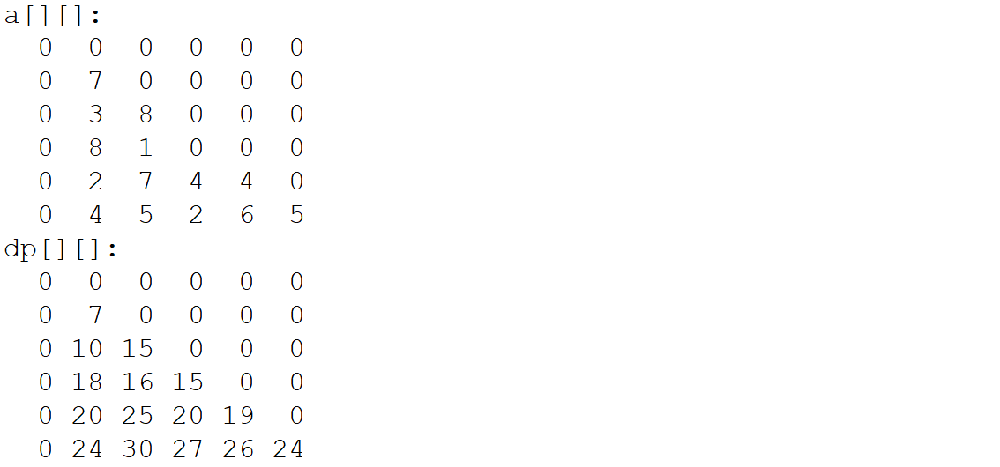

### 题目描述



上图给出了一个数字三角形。从三角形的顶部到底部有很多条不同的路径。对于每条路径，把路径上面的数加起来可以得到一个和，你的任务就是找到最大的和。

路径上的每一步只能从一个数走到下一层和它最近的左边的那个数或者右 边的那个数。此外，向左下走的次数与向右下走的次数相差不能超过 1。

### 输入描述

输入的第一行包含一个整数 `N` (1≤`N`≤100)，表示三角形的行数。

下面的 `N` 行给出数字三角形。数字三角形上的数都是 0 至 100 之间的整数。

### 输出描述

输出一个整数，表示答案。

### 输入输出样例

#### 示例

> 输入

```txt
5
7
3 8
8 1 0
2 7 4 4
4 5 2 6 5
```

> 输出

```txt
27
```

### 运行限制

- 最大运行时间：1s
- 最大运行内存: 256M

解法一：

数组a\[n+1][n+1]储存三角形，数组dp\[n+1][n+1]储存三角形从（1，1）到（i，j）的总权值。若最后一行为奇数，则取中间两个数较大的一个。为偶数，则取中间的数。



```java
import java.util.Scanner;

public class Main {
	public static void main(String[] args) {
		Scanner sc = new Scanner(System.in);
		int n = sc.nextInt();		//输入三角形的行数 
		int [][] a = new int[n+1][n+1] ; 
		int [][] dp = new int[n+1][n+1];
		for(int i=1;i<=n;i++)
		{
			for(int j=1;j<=i;j++)
			{
				a[i][j] = sc.nextInt();	   //输入三角形数值 
			}
		}
		dp[1][1] = a[1][1];
		for (int i = 2; i <= n; i++) {
			for (int j = 1; j <= i; j++) {
				//左下
				if(j==1) {
					dp[i][j] = dp[i-1][j] + a[i][j];
				}
				//中间
				if(j<i) {
					dp[i][j] = Math.max(dp[i-1][j-1],dp[i-1][j]) + a[i][j];
				}
				//右下
				if(j==i) {
					dp[i][j] = dp[i-1][j-1] + a[i][j];
				}
			}
		}
		if(n%2==0) {//偶数
			System.out.println(Math.max(dp[n][n/2],dp[n][n/2+1]));
		}else if(n%2==1) {//奇数
			System.out.println(dp[n][n/2+1]);
		}
	}
}
```

