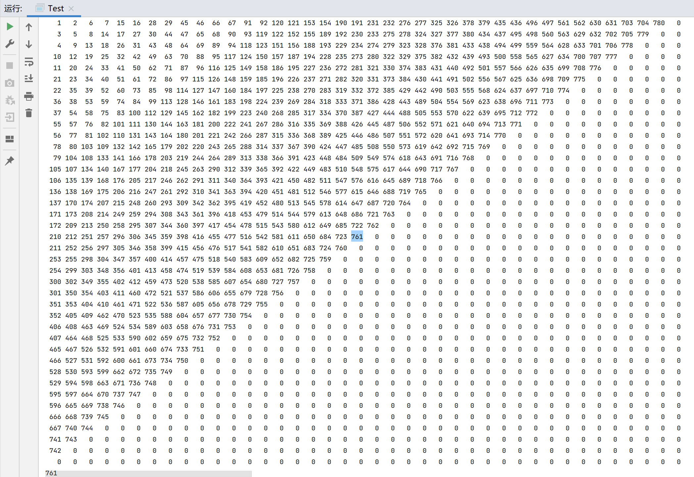

# 蛇形填数

```
【问题描述】
如下图所示，小明用从 1 开始的正整数“蛇形”填充无限大的矩阵。
1 2 6 7 15 ...
3 5 8 14 ...
4 9 13 ...
10 12 ...
11 ...
...
容易看出矩阵第二行第二列中的数是 5。请你计算矩阵中第 20 行第 20 列的数是多少？
```

**解法一：**

思路：补全小部分矩阵，发现规律，坐标（行，列）（0,0）=1，（1,1）=5，（2,2）=13，（3,3）=25，（4,4）=41，（5,5）=61......	1+**4**=5	5+**8**=13	13+**12**=25	25+**16**=41....

```
public class CMain {
    public static void main(String[] args) {
        int [] a =new int[21];
        int [] b=new int[20];
        a[1]=1;b[1]=4;
        for(int i=2;i<=19;i++){//b[]数组4,8,12,16,20....
            b[i]=b[i-1]+4;
        }
        for(int j=2;j<=20;j++){//a[]行列相同时的数组成的数组
            a[j]=b[j-1]+a[j-1];//数组a[j]的等于前一项a[j-1]与相同下标的数组b[j-1]的和
        }
        System.out.println(a[20]);
    }
}
```

**解法二：**

构造补全矩阵

```java
public class Main {
    public static void main(String[] args) {
        int [][] a = new int[40][40];//因为值在对角线中点处，二维数组的宽高至少要定义为40
        int n = 1, row = 0, col = 0;
        a[0][0] = 1;
        while(a[19][19]==0) {
            //右走
            a[row][++col] = ++n;
            //左下
            while(col!=0) {
                a[++row][--col] = ++n;
            }
            //下走
            a[++row][col] = ++n;
            //右上
            while(row!=0) {
                a[--row][++col] = ++n;
            }
        }
        System.out.println(a[19][19]);
    }
}
```

答案：761

运行结果：

