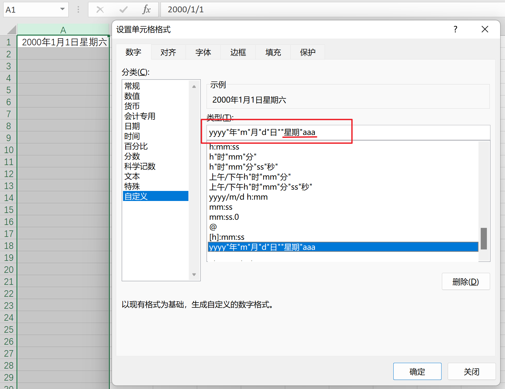
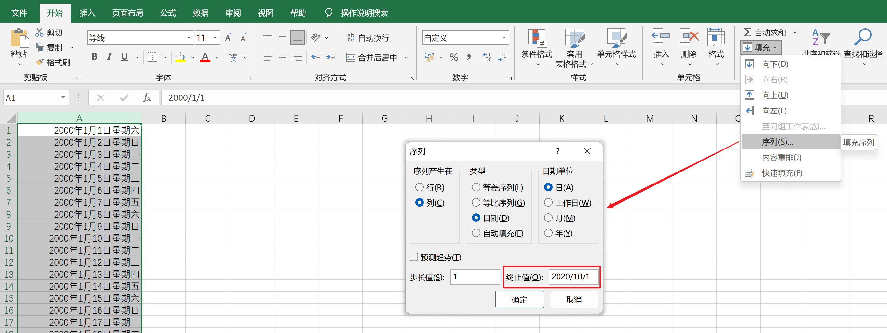

# 跑步锻炼

### 题目描述

**本题为填空题，只需要算出结果后，在代码中使用输出语句将所填结果输出即可。**

小蓝每天都锻炼身体。

正常情况下，小蓝每天跑 1 千米。如果某天是周一或者月初（1 日），为了激励自己，小蓝要跑 2 千米。如果同时是周一或月初，小蓝也是跑 2 千米。

小蓝跑步已经坚持了很长时间，从 2000 年 1 月 1 日周六（含）到 2020 年 10 月 1 日周四（含）。请问这段时间小蓝总共跑步多少千米？

### 运行限制

- 最大运行时间：1s
- 最大运行内存: 128M

**解法一：利用Excel自动生成日期+星期。**

第一步：新建一个Excel文件，在第一个单元格写`yyyy/mm/dd`。


第二步:选中整列，设置单元格格式。



第三步：填写终止值自动填充。也可以下拉单元格填充。



最后复制所有日期到IDE。

```java
public class Main {
    public static void main(String[] args) {
        String [] str = {"2000年1月1日 星期六" , 
                "2000年1月2日 星期日" , 
                "2000年1月3日 星期一" , 
                		.
                        .
                        .
                        .
                "2020年9月29日 星期二" , 
                "2020年9月30日 星期三" , 
                "2020年10月1日 星期四" };
        int n = 0;
        for (int i = 0; i < str.length; i++) {
            //防止“11日,21日,31日”等，造成错误计算
            if(str[i].contains("月1日")||str[i].contains("星期一")) {
                n+=2;
            }else {
                n++;
            }
        }
        System.out.println(n);
    }
}
```

