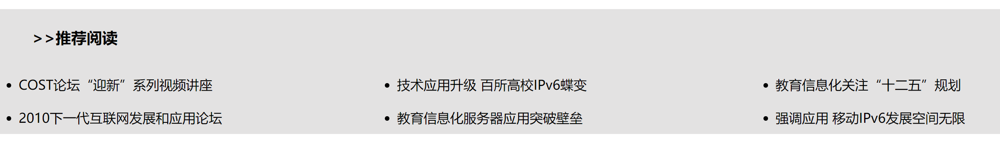

# CSS笔记

## 浮动属性(float)

作用：浮动属性`float`可以让HTML元素浮动向左或向右移动，如让图像浮动到一段文字的左侧；让无序列表<ul>不换行。

<table>
<thead>
<tr>
<th align="left">值</th>
<th align="left">说明</th>
</tr>
</thead>
<tbody>
<tr>
<td align="left">left</td>
<td align="left">元素在其父容器中向左浮动</td>
</tr>
<tr>
<td align="left">right</td>
<td align="left">元素在其父容器中向右浮动</td>
</tr>
<tr>
<td align="left">none</td>
<td align="left">默认，元素不浮动 ( 将显示在它在页面中本该出现的位置 )</td>
</tr>
<tr>
<td align="left">inherit</td>
<td align="left">该元素继承其父级的浮点值</td>
</tr>
</tbody>
</table>

例：

```css
ul li{ float:left; }
```



