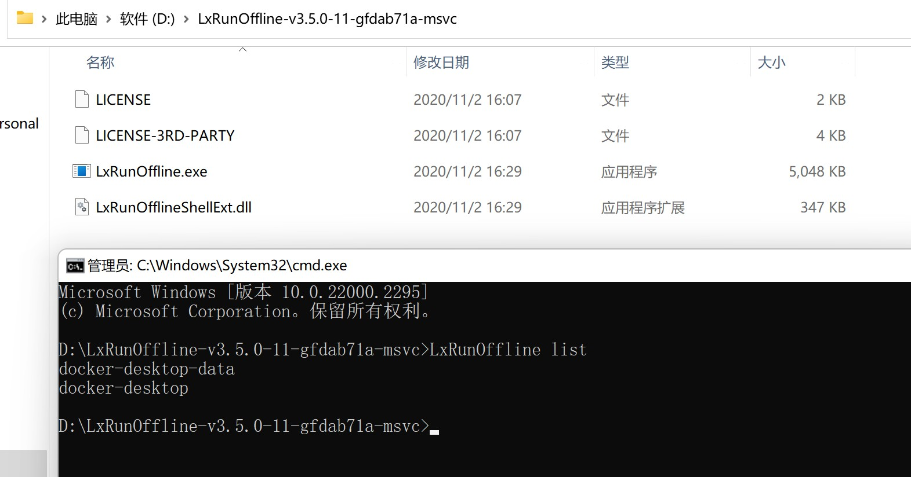
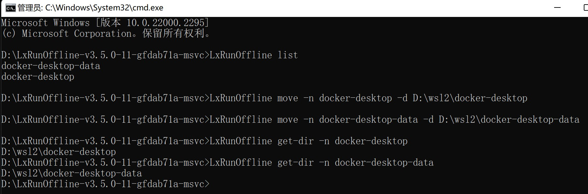
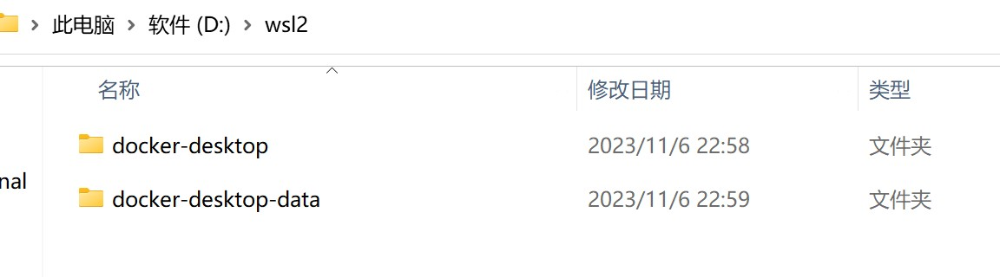

# LxRunOffline转移WSL2的安装目录

命令`wsl --install`安装WSL(Win­dows Sub­sys­tem for Linux)会默认安装到C盘中。使用LxRunOffline简单完美转移WSL整个安装目录，拯救爆红的C盘。

### 1.安装LxRunOffline

下载解压：

https://github.com/Andy1208-lee/LxRunOffline/raw/main/LxRunOffline-v3.5.0-11-gfdab71a-msvc.zip

### 2.转移WSL安装目录

进入解压的目录，管理员运行CMD，然后`LxRunOffline list`查看系统中已安装的WSL。



分别移动WSL目录到D盘

```bash
LxRunOffline move -n <WSL名称> -d <路径>
```

查看WSL路径

```
LxRunOffline get-dir -n <WSL名称>
```



查看D盘目录



至此，大功告成！