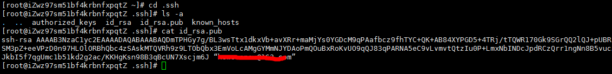
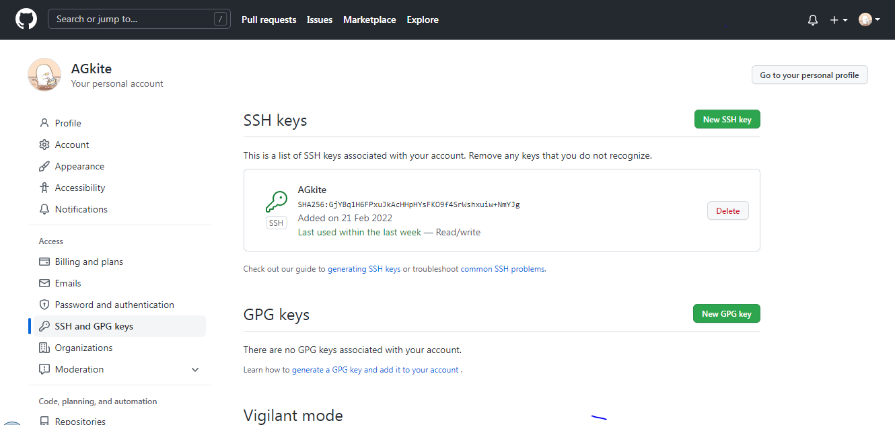
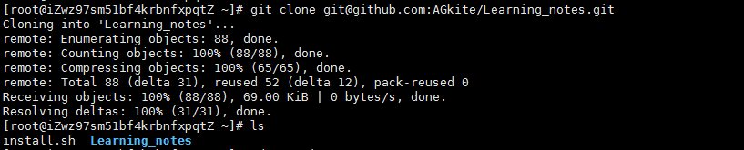
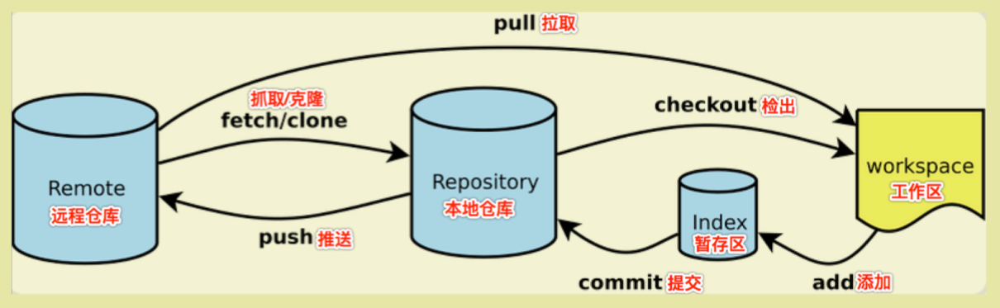
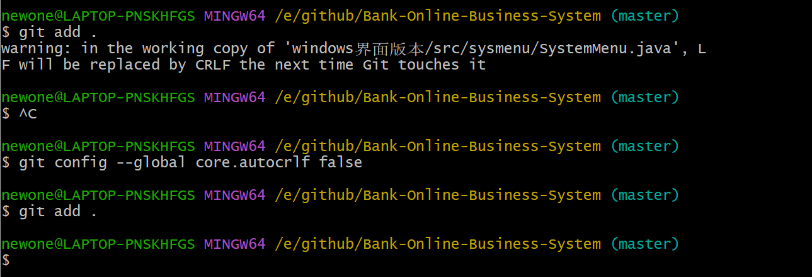
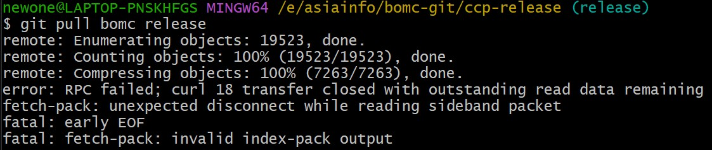

## **Git学习笔记---linux**

### **本地安装Git**

查看是否已经有了ssh密钥

```bash
cd ~/.ssh			
```

若没有安装ssh

```bash
sudo yum install sshd 			
sudo yum install openssh-server			//centos
```

 github的SSH配置：

 生成SSH密钥过程：

```bash
ssh-keygen -t rsa -C "********@gmail.com"	//生成密钥
```

生成两个文件私钥id_rsa和公钥id_rsa.pub

```bash
cat id_rsa.pub	//查看公钥
```

复制公钥到GitHub->settings->SSH and GPG keys





测试ssh是否成功设置

```bash
ssh git@github.com
```

本地的id_rsa密钥跟GitHub上的id_rsa.pub公钥进行配对，授权成功后才可以提交代码。


设置Git的user name和email：

```bash
# 全局设置
git config --global user.name "*****"
git config --global user.email "********@gmail.com"
# 单个仓库设置
git config user.name "*****"
git config user.email "********@gmail.com"
```

之后就可以克隆远程仓库到本地



编辑仓库文件后同步到远程仓库

首先将文件加入暂存区

```bash
git add . //把本地所有untrack的文件都加入暂存区，并且会根据.gitignore做过滤
git add * //忽略.gitignore把任何文件都加入
```

再将暂存区的内容提交到版本库（对象库）中

```bash
git commit -m "update"	//参数 -m 后输入提交描述
```

最后推送本地更新到远程仓库

```bash
git push origin master	//master是分支名称
```

---

### Git工作原理



 拉取远程仓库到本地

```bash
git pull origin master
```

查看暂存区文件

```bash
git ls-files
```

查看当前版本库的状态

```bash
git status  
```

查看指定commit_id对应的修改文件列表

```bash
git show --raw 			//查看最后一次提交记录的修改文件信息
git show --raw c9f685ea9fa05d88fa9a0a44ed286f38995d2eb3
```

---

### **遇到的错误：**

1. push前最好先pull避免发生如下冲突

```bash
$ git push origin master
To github.com:AGkite/Learning_notes.git
 ! [rejected]        master -> master (fetch first)
error: failed to push some refs to 'github.com:AGkite/Learning_notes.git'
hint: Updates were rejected because the remote contains work that you do
hint: not have locally. This is usually caused by another repository pushing
hint: to the same ref. You may want to first integrate the remote changes
hint: (e.g., 'git pull ...') before pushing again.
hint: See the 'Note about fast-forwards' in 'git push --help' for details.
```
解决办法：向远程仓库拉取代码pull，同步本地仓库。

---

2. Git Warning: LF will be replaced by CRLF



解决办法：

```bash
git config --global core.autocrlf false
```

---

3. 缓冲区过小



解决办法：

```bash
# 设置拉取缓冲区大小为 512（524288000） MB 或 1 GB（1048576000）
git config http.postBuffer 524288000
```

[GitHub官方文档:](https://docs.github.com/cn)


