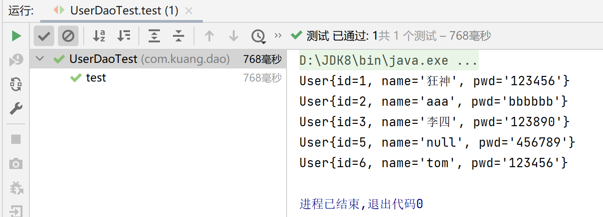
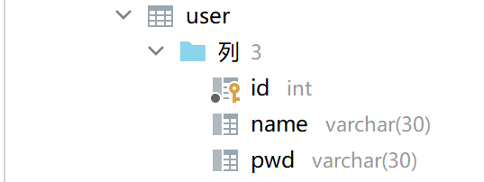
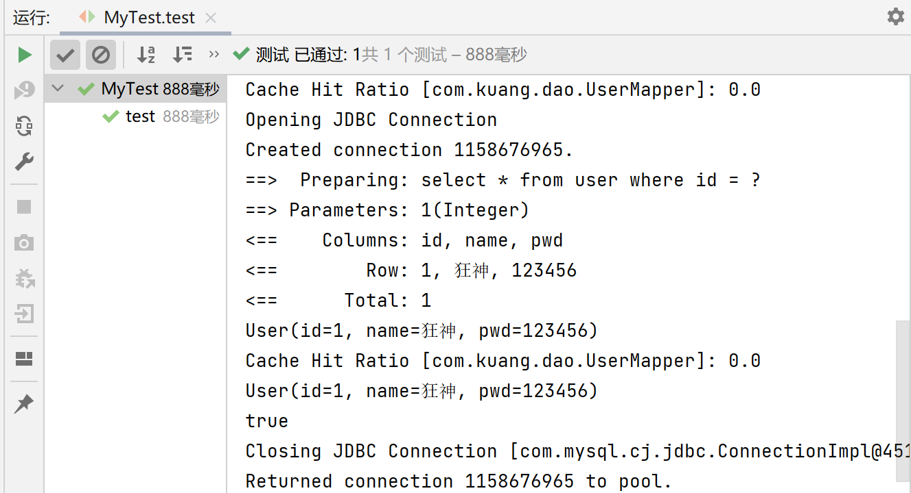
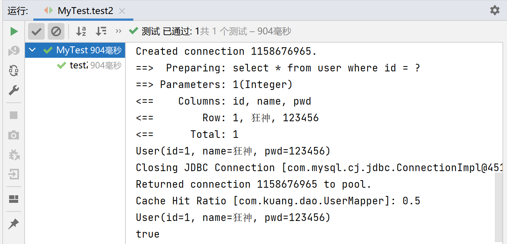

# Mybatis笔记

## 一、简单使用

**第一步：搭建实验数据库**

```sql
CREATE DATABASE `mybatis`;

USE `mybatis`;

DROP TABLE IF EXISTS `user`;

CREATE TABLE `user` (
`id` int(20) NOT NULL,
`name` varchar(30) DEFAULT NULL,
`pwd` varchar(30) DEFAULT NULL,
PRIMARY KEY (`id`)
) ENGINE=InnoDB DEFAULT CHARSET=utf8;

insert  into `user`(`id`,`name`,`pwd`) values (1,'张三','123456'),(2,'李四','abcdef'),(3,'王五','987654');
```

**第二步：Maven导包**

```xml
<!--导入依赖-->
<dependencies>
    <!--mysql驱动-->
    <dependency>
        <groupId>mysql</groupId>
        <artifactId>mysql-connector-java</artifactId>
        <version>8.0.29</version>
    </dependency>
    <!--mybatis-->
    <dependency>
        <groupId>org.mybatis</groupId>
        <artifactId>mybatis</artifactId>
        <version>3.5.2</version>
    </dependency>
    <!--junit-->
    <dependency>
        <groupId>junit</groupId>
        <artifactId>junit</artifactId>
        <version>4.12</version>
    </dependency>
</dependencies>
```

**第三步：编写MyBatis核心配置文件**

- [查看帮助文档](https://mybatis.org/mybatis-3/)

```xml
<?xml version="1.0" encoding="UTF-8" ?>
<!DOCTYPE configuration
        PUBLIC "-//mybatis.org//DTD Config 3.0//EN"
        "https://mybatis.org/dtd/mybatis-3-config.dtd">

<configuration>
    <environments default="development">
        <environment id="development">
            <transactionManager type="JDBC"/>
            <dataSource type="POOLED">
                <property name="driver" value="com.mysql.cj.jdbc.Driver"/>
                <property name="url" value="jdbc:mysql://localhost:3306/mybatis?useSSL=true&amp;characterEncoding=UTF-8&amp;useUnicode=true&amp;serverTimezone=GMT&amp;allowPublicKeyRetrieval=true"/>
                <property name="username" value="root"/>
                <property name="password" value="123456"/>
            </dataSource>
        </environment>
    </environments>

    <mappers>
        <mapper resource="com/kuang/dao/UserMapper.xml"/>
    </mappers>
</configuration>
```

**第四步：编写MyBatis工具类**

- [查看帮助文档](https://mybatis.org/mybatis-3/)

```java
import org.apache.ibatis.io.Resources;
import org.apache.ibatis.session.SqlSession;
import org.apache.ibatis.session.SqlSessionFactory;
import org.apache.ibatis.session.SqlSessionFactoryBuilder;
import java.io.IOException;
import java.io.InputStream;

//sqlSessionFactory ---> sqlSession
public class MybatisUtils {
    private static SqlSessionFactory sqlSessionFactory;
    static{
        try{
            //使用Mybatis第一步：获取sqlSessionFactory对象
            String resource = "mybatis-config.xml";
            InputStream inputStream = Resources.getResourceAsStream(resource);
            sqlSessionFactory = new SqlSessionFactoryBuilder().build(inputStream);
        }catch(IOException e){
            e.printStackTrace();
        }
    }
    //既然有了 SqlSessionFactory，顾名思义，我们可以从中获得 SqlSession 的实例。
    // SqlSession 提供了在数据库执行 SQL 命令所需的所有方法。
    public static SqlSession getSqlSession(){
        return sqlSessionFactory.openSession();//openSession(true)时设置自动提交事务
    }
}

```

**第五步：创建实体类**

```java
public class User {
   private int id;  //id
   private String name;   //姓名
   private String pwd;   //密码
   
   //构造,有参,无参
   //set/get
   //toString()
}
```

**第六步：编写Mapper接口类**

```java
public interface UserMapper {
   List<User> selectUser();
}
```

**第七步：编写Mapper.xml配置文件**

```xml
<?xml version="1.0" encoding="UTF-8" ?>
<!DOCTYPE mapper
        PUBLIC "-//mybatis.org//DTD Mapper 3.0//EN"
        "https://mybatis.org/dtd/mybatis-3-mapper.dtd">
<!--绑定接口，namespace中的名称为对应Mapper接口的完整包名,必须一致！-->
<mapper namespace="com.kuang.dao.UserMapper">
    <select id="getUserList" resultType="com.kuang.pojo.User"><!--id:接口方法名-->
        select * from mybatis.user
    </select>
</mapper>
```

**第八步：编写测试类**

```java
public class UserDaoTest {
    @Test
    public void test(){
        //第一步：获取SqlSession对象,使用try-with-resource自动关闭SqlSession
        try (SqlSession sqlSession = MybatisUtils.getSqlSession()) {
            //方式一：getMapper
            UserMapper userMapper = sqlSession.getMapper(UserMapper.class);
            List<User> userList = userMapper.getUserList();

            //方式二：getMapper
            //List<User> userList = sqlSession.selectList("com.kuang.dao.UserDao.getUserList");
            for (User user : userList) {
                System.out.println(user);
            }
        }
    }
}
```

> 可能出现问题：Maven静态资源过滤问题

```xml
<!--在build中配置resources,来防止资源导出失败的问题-->
<build>
    <resources>
        <resource>
            <directory>src/main/resources</directory>
            <includes>
                <include>**/*.properties</include>
                <include>**/*.xml</include>
            </includes>
            <filtering>false</filtering>
        </resource>
        <resource>
            <directory>src/main/java</directory>
            <includes>
                <include>**/*.properties</include>
                <include>**/*.xml</include>
            </includes>
            <filtering>false</filtering>
        </resource>
    </resources>
</build>
```

**运行成功**



---

## 二、CRUD操作及配置解析

### select

**需求：根据id查询用户**

1、在UserMapper中添加对应方法

```java
public interface UserMapper {
   //查询全部用户
   List<User> selectUser();
   //根据id查询用户
   User selectUserById(int id);
}
```

2、在UserMapper.xml中添加Select语句

```xml
<select id="selectUserById" resultType="com.kuang.pojo.User">
select * from user where id = #{id}
</select>
```

3、测试类中测试

```java
@Test
public void tsetSelectUserById() {
   SqlSession session = MybatisUtils.getSession();  //获取SqlSession连接
   UserMapper mapper = session.getMapper(UserMapper.class);
   User user = mapper.selectUserById(1);
   System.out.println(user);
   session.close();
}
```

**课堂练习**：根据 密码 和 名字 查询用户

思路一：直接在方法中传递参数

1、在接口方法的参数前加 @Param属性

2、Sql语句编写的时候，直接取@Param中设置的值即可，不需要单独设置参数类型

```xml
//通过密码和名字查询用户
User selectUserByNP(@Param("username") String username,@Param("pwd") String pwd);

/*
   <select id="selectUserByNP" resultType="com.kuang.pojo.User">
     select * from user where name = #{username} and pwd = #{pwd}
   </select>
*/
```

思路二：使用万能的Map

1、在接口方法中，参数直接传递Map；

```java
User selectUserByNP2(Map<String,Object> map);
```

2、编写sql语句的时候，需要传递参数类型，参数类型为map

```xml
<select id="selectUserByNP2" parameterType="map" resultType="com.kuang.pojo.User">
select * from user where name = #{username} and pwd = #{pwd}
</select>
```

3、在使用方法的时候，Map的 key 为 sql中取的值即可，没有顺序要求！

```java
Map<String, Object> map = new HashMap<String, Object>();
map.put("username","小明");
map.put("pwd","123456");
User user = mapper.selectUserByNP2(map);
```

**总结：如果参数过多，我们可以考虑直接使用Map实现，如果参数比较少，直接传递参数即可**

---

### insert

我们一般使用insert标签进行插入操作，它的配置和select标签差不多！

**需求：给数据库增加一个用户**

1、在UserMapper接口中添加对应的方法

```java
//添加一个用户
int addUser(User user);
```

2、在UserMapper.xml中添加insert语句

```xml
<insert id="addUser" parameterType="com.kuang.pojo.User">
    insert into user (id,name,pwd) values (#{id},#{name},#{pwd})
</insert>
```

3、测试

```java
@Test
public void testAddUser() {
   SqlSession session = MybatisUtils.getSession();
   UserMapper mapper = session.getMapper(UserMapper.class);
   User user = new User(5,"王五","zxcvbn");
   int i = mapper.addUser(user);
   System.out.println(i);
   session.commit(); //提交事务,重点!不写的话不会提交到数据库
   session.close();
}
```

**注意点：增、删、改操作需要提交事务！**

---

### update

我们一般使用update标签进行更新操作，它的配置和select标签差不多！

**需求：修改用户的信息**

1、同理，编写接口方法

```java
//修改一个用户
int updateUser(User user);
```

2、编写对应的配置文件SQL

```xml
<update id="updateUser" parameterType="com.kuang.pojo.User">
  update user set name=#{name},pwd=#{pwd} where id = #{id}
</update>
```

3、测试

```java
@Test
public void testUpdateUser() {
   SqlSession session = MybatisUtils.getSession();
   UserMapper mapper = session.getMapper(UserMapper.class);
   User user = mapper.selectUserById(1);
   user.setPwd("asdfgh");
   int i = mapper.updateUser(user);
   System.out.println(i);
   session.commit(); //提交事务,重点!不写的话不会提交到数据库
   session.close();
}
```

---
### delete

我们一般使用delete标签进行删除操作，它的配置和select标签差不多！

**需求：根据id删除一个用户**

1、同理，编写接口方法

```java
//根据id删除用户
int deleteUser(int id);
```

2、编写对应的配置文件SQL

```xml
<delete id="deleteUser" parameterType="int">
  delete from user where id = #{id}
</delete>
```

3、测试

```java
@Test
public void testDeleteUser() {
   SqlSession session = MybatisUtils.getSession();
   UserMapper mapper = session.getMapper(UserMapper.class);
   int i = mapper.deleteUser(5);
   System.out.println(i);
   session.commit(); //提交事务,重点!不写的话不会提交到数据库
   session.close();
}
```

### **模糊查询like语句该怎么写?**

第1种：在Java代码中添加sql通配符。

```java
string wildcardname = “%smi%”;
list<name> names = mapper.selectlike(wildcardname);
```

```xml
<select id=”selectlike”>
select * from foo where bar like #{value}
</select>
```

第2种：在sql语句中拼接通配符，会引起sql注入

```java
string wildcardname = “smi”;
list<name> names = mapper.selectlike(wildcardname);
```

```xml
<select id=”selectlike”>
    select * from foo where bar like "%"#{value}"%"
</select>
```

**小结：**

- 所有的增删改操作都需要提交事务！
- 接口所有的普通参数，尽量都写上@Param参数，尤其是多个参数时，必须写上！
- 有时候根据业务的需求，可以考虑使用map传递参数！
- 为了规范操作，在SQL的配置文件中，我们尽量将Parameter参数和resultType都写上！

---

### 配置解析

> **核心配置文件**

- mybatis-config.xml 系统核心配置文件
- MyBatis 的配置文件包含了会深深影响 MyBatis 行为的设置和属性信息。
- 能配置的内容如下：

```xml
configuration（配置）
properties（属性）
settings（设置）
typeAliases（类型别名）
typeHandlers（类型处理器）
objectFactory（对象工厂）
plugins（插件）
environments（环境配置）
environment（环境变量）
transactionManager（事务管理器）
dataSource（数据源）
databaseIdProvider（数据库厂商标识）
mappers（映射器）
<!-- 注意元素节点的顺序！顺序不对会报错 -->
```

我们可以阅读 mybatis-config.xml 上面的dtd的头文件！

---

> **environments元素**

```xml
<environments default="development">
 <environment id="development">
   <transactionManager type="JDBC">
     <property name="..." value="..."/>
   </transactionManager>
   <dataSource type="POOLED">
     <property name="driver" value="${driver}"/>
     <property name="url" value="${url}"/>
     <property name="username" value="${username}"/>
     <property name="password" value="${password}"/>
   </dataSource>
 </environment>
</environments>
```

- 配置MyBatis的多套运行环境，将SQL映射到多个不同的数据库上，必须指定其中一个为默认运行环境（通过default指定）

- 子元素节点：**environment**

- - dataSource 元素使用标准的 JDBC 数据源接口来配置 JDBC 连接对象的资源。

  - 数据源是必须配置的。

  - 有三种内建的数据源类型

    ```xml
    type="[UNPOOLED|POOLED|JNDI]"）
    ```

  - unpooled：这个数据源的实现只是每次被请求时打开和关闭连接。

  - **pooled**：这种数据源的实现利用“池”的概念将 JDBC 连接对象组织起来 , 这是一种使得并发 Web 应用快速响应请求的流行处理方式。

  - jndi：这个数据源的实现是为了能在如 Spring 或应用服务器这类容器中使用，容器可以集中或在外部配置数据源，然后放置一个 JNDI 上下文的引用。

  - 数据源也有很多第三方的实现，比如dbcp，c3p0，druid等等....

  - 详情：点击查看官方文档

  - 这两种事务管理器类型都不需要设置任何属性。

  - 具体的一套环境，通过设置id进行区别，id保证唯一！

  - 子元素节点：transactionManager - [ 事务管理器 ]

    ```xml
    <!-- 语法 -->
    <transactionManager type="[ JDBC | MANAGED ]"/>
    ```

  - 子元素节点：**数据源（dataSource）**

---

> **mappers元素**

**mappers**

- 映射器 : 定义映射SQL语句文件
- 既然 MyBatis 的行为其他元素已经配置完了，我们现在就要定义 SQL 映射语句了。但是首先我们需要告诉 MyBatis 到哪里去找到这些语句。Java 在自动查找这方面没有提供一个很好的方法，所以最佳的方式是告诉 MyBatis 到哪里去找映射文件。你可以使用相对于类路径的资源引用， 或完全限定资源定位符（包括 `file:///` 的 URL），或类名和包名等。映射器是MyBatis中最核心的组件之一，在MyBatis 3之前，只支持xml映射器，即：所有的SQL语句都必须在xml文件中配置。而从MyBatis 3开始，还支持接口映射器，这种映射器方式允许以Java代码的方式注解定义SQL语句，非常简洁。

**引入资源方式**

```xml
<!-- 使用相对于类路径的资源引用 -->
<mappers>
 <mapper resource="org/mybatis/builder/PostMapper.xml"/>
</mappers>
<!-- 使用完全限定资源定位符（URL） -->
<mappers>
 <mapper url="file:///var/mappers/AuthorMapper.xml"/>
</mappers>
<!--
使用映射器接口实现类的完全限定类名
需要配置文件名称和接口名称一致，并且位于同一目录下
-->
<mappers>
 <mapper class="org.mybatis.builder.AuthorMapper"/>
</mappers>
<!--
将包内的映射器接口实现全部注册为映射器
但是需要配置文件名称和接口名称一致，并且位于同一目录下
-->
<mappers>
 <package name="org.mybatis.builder"/>
</mappers>
```

---

> **Properties优化**

数据库这些属性都是可外部配置且可动态替换的，既可以在典型的 Java 属性文件中配置，亦可通过 properties 元素的子元素来传递。具体的官方文档

我们来优化我们的配置文件

第一步 ; 在资源目录下新建一个db.properties

```properties
driver=com.mysql.cj.jdbc.Driver
url=jdbc:mysql://localhost:3306/mybatis?useSSL=true&useUnicode=true&characterEncoding=UTF-8&serverTimeZone=GMT&allowPublicKeyRetrieval=true
username=root
password=123456
```

第二步 : 将文件导入properties 配置文件

```xml
<configuration>
   <!--导入properties文件-->
   <properties resource="db.properties"/>
   <environments default="development">
       <environment id="development">
           <transactionManager type="JDBC"/>
           <dataSource type="POOLED">
               <property name="driver" value="${driver}"/>
               <property name="url" value="${url}"/>
               <property name="username" value="${username}"/>
               <property name="password" value="${password}"/>
           </dataSource>
       </environment>
   </environments>
   <mappers>
       <mapper resource="mapper/UserMapper.xml"/>
   </mappers>
</configuration>
```

## 三、ResultMap

### 属性名和字段名不一致的问题

1、查看之前的数据库的字段名



2、Java中的实体类设计

```java
public class User {

   private int id;  //id
   private String name;   //姓名
   private String password;   //密码和数据库不一样！
   
   //构造
   //set/get
   //toString()
}
```

3、接口

```java
//根据id查询用户
User selectUserById(int id);
```

4、mapper映射文件

```xml
<select id="selectUserById" resultType="user">
  select * from user where id = #{id}
</select>
```

5、测试

```java
@Test
public void testSelectUserById() {
   SqlSession session = MybatisUtils.getSession();  //获取SqlSession连接
   UserMapper mapper = session.getMapper(UserMapper.class);
   User user = mapper.selectUserById(1);
   System.out.println(user);
   session.close();
}
```

**结果:**

- User{id=1, name='狂神', password='null'}
- 查询出来发现 password 为空 . 说明出现了问题！

**分析：**

- select * from user where id = #{id} 可以看做

  select  id,name,pwd  from user where id = #{id}

- mybatis会根据这些查询的列名(会将列名转化为小写,数据库不区分大小写) , 去对应的实体类中查找相应列名的set方法设值 , 由于找不到setPwd() , 所以password返回null ; 【自动映射】

####  解决方案

方案一：为列名指定别名 , 别名和java实体类的属性名一致 .

```xml
<select id="selectUserById" resultType="User">
  select id , name , pwd as password from user where id = #{id}
</select>
```

**方案二：使用结果集映射->ResultMap** 【推荐】

```xml
<resultMap id="UserMap" type="User">
   <!-- id为主键 -->
   <id column="id" property="id"/>
   <!-- column是数据库表的列名 , property是对应实体类的属性名 -->
   <result column="name" property="name"/>
   <result column="pwd" property="password"/>
</resultMap>

<select id="selectUserById" resultMap="UserMap">
  select id , name , pwd from user where id = #{id}
</select>
```

---

## 四、使用注解开发

### 面向接口编程

- **根本原因 :  解耦 , 可拓展 , 提高复用 , 分层开发中 , 上层不用管具体的实现 , 大家都遵守共同的标准 , 使得开发变得容易 , 规范性更好**

**三个面向区别**

- 面向对象是指，我们考虑问题时，以对象为单位，考虑它的属性及方法 .
- 面向过程是指，我们考虑问题时，以一个具体的流程（事务过程）为单位，考虑它的实现 .
- 接口设计与非接口设计是针对复用技术而言的，与面向对象（过程）不是一个问题.更多的体现就是对系统整体的架构

---

### 利用注解开发

**注意：**利用注解开发就不需要mapper.xml映射文件了 .

1、我们在我们的接口中添加注解

```java
//查询全部用户
@Select("select id,name,pwd password from user")
public List<User> getAllUser();
```

2、在mybatis的核心配置文件中注入

```xml
<!--使用class绑定接口-->
<mappers>
   <mapper class="com.kuang.mapper.UserMapper"/>
</mappers>
```

3、我们去进行测试

```java
@Test
public void testGetAllUser() {
   SqlSession session = MybatisUtils.getSession();
   //本质上利用了jvm的动态代理机制
   UserMapper mapper = session.getMapper(UserMapper.class);
   List<User> users = mapper.getAllUser();
   for (User user : users){
       System.out.println(user);
  }
   session.close();
}
```

---

### 关于@Param

@Param注解用于给方法参数起一个名字。以下是总结的使用原则：

- 在方法只接受一个参数的情况下，可以不使用@Param。
- 在方法接受多个参数的情况下，建议一定要使用@Param注解给参数命名。
- 如果参数是 JavaBean ， 则不能使用@Param。
- 不使用@Param注解时，参数只能有一个，并且是Javabean。

---

### #与$的区别

- \#{} 的作用主要是替换预编译语句(PrepareStatement)中的占位符? 【推荐使用】

  ```xml
  INSERT INTO user (name) VALUES (#{name});
  INSERT INTO user (name) VALUES (?);
  ```

- ${} 的作用是直接进行字符串替换

  ```xml
  INSERT INTO user (name) VALUES ('${name}');
  INSERT INTO user (name) VALUES ('kuangshen');
  ```

---

## 五、动态SQL

什么是动态SQL：**动态SQL指的是根据不同的查询条件 , 生成不同的Sql语句.**

### if 语句

```xml
<select id="queryBlogIf" parameterType="map" resultType="blog">
  select * from blog where
   <if test="title != null">
      title = #{title}
   </if>
   <if test="author != null">
      and author = #{author}
   </if>
</select>
```

### Where

修改上面的SQL语句；

```xml
<select id="queryBlogIf" parameterType="map" resultType="blog">
  select * from blog
   <where>
       <if test="title != null">
          title = #{title}
       </if>
       <if test="author != null">
          and author = #{author}
       </if>
   </where>
</select>
```

这个“where”标签会知道如果它包含的标签中有返回值的话，它就插入一个‘where’。此外，如果标签返回的内容是以AND 或OR 开头的，则它会剔除掉。

### Set

同理，上面的对于查询 SQL 语句包含 where 关键字，如果在进行更新操作的时候，含有 set 关键词，我们怎么处理呢？

```
<!--注意set是用的逗号隔开-->
<update id="updateBlog" parameterType="map">
  update blog
     <set>
         <if test="title != null">
            title = #{title},
         </if>
         <if test="author != null">
            author = #{author}
         </if>
     </set>
  where id = #{id};
</update>
```

### choose语句

有时候，我们不想用到所有的查询条件，只想选择其中的一个，查询条件有一个满足即可，使用 choose 标签可以解决此类问题，类似于 Java 的 switch 语句

```xml
<select id="queryBlogChoose" parameterType="map" resultType="blog">
  select * from blog
   <where>
       <choose>
           <when test="title != null">
                title = #{title}
           </when>
           <when test="author != null">
              and author = #{author}
           </when>
           <otherwise>
              and views = #{views}
           </otherwise>
       </choose>
   </where>
</select>
```

### SQL片段

有时候可能某个 sql 语句我们用的特别多，为了增加代码的重用性，简化代码，我们需要将这些代码抽取出来，然后使用时直接调用。

**提取SQL片段：**

```xml
<sql id="if-title-author">
   <if test="title != null">
      title = #{title}
   </if>
   <if test="author != null">
      and author = #{author}
   </if>
</sql>
```

**引用SQL片段：**

```xml
<select id="queryBlogIf" parameterType="map" resultType="blog">
  select * from blog
   <where>
       <!-- 引用 sql 片段，如果refid 指定的不在本文件中，那么需要在前面加上 namespace -->
       <include refid="if-title-author"></include>
       <!-- 在这里还可以引用其他的 sql 片段 -->
   </where>
</select>
```

注意：

①、最好基于 单表来定义 sql 片段，提高片段的可重用性

②、在 sql 片段中不要包括 where

### Foreach

将数据库中前三个数据的id修改为1,2,3；

需求：我们需要查询 blog 表中 id 分别为1,2,3的博客信息

1、编写接口

```java
List<Blog> queryBlogForeach(Map map);
```

2、编写SQL语句

```xml
<select id="queryBlogForeach" parameterType="map" resultType="blog">
  select * from blog
   <where>
       <!--
       collection:指定输入对象中的集合属性
       item:每次遍历生成的对象
       open:开始遍历时的拼接字符串
       close:结束时拼接的字符串
       separator:遍历对象之间需要拼接的字符串
       select * from blog where 1=1 and (id=1 or id=2 or id=3)
     -->
       <foreach collection="ids"  item="id" open="and (" close=")" separator="or">
          id=#{id}
       </foreach>
   </where>
</select>
```

3、测试

```java
@Test
public void testQueryBlogForeach(){
   SqlSession session = MybatisUtils.getSession();
   BlogMapper mapper = session.getMapper(BlogMapper.class);

   HashMap map = new HashMap();
   List<Integer> ids = new ArrayList<Integer>();
   ids.add(1);
   ids.add(2);
   ids.add(3);
   map.put("ids",ids);

   List<Blog> blogs = mapper.queryBlogForeach(map);

   System.out.println(blogs);

   session.close();
}
```

---

## 六、缓存

### 简介

1、什么是缓存 [ Cache ]？

- 存在内存中的临时数据。
- 将用户经常查询的数据放在缓存（内存）中，用户去查询数据就不用从磁盘上(关系型数据库数据文件)查询，从缓存中查询，从而提高查询效率，解决了高并发系统的性能问题。

2、为什么使用缓存？

- 减少和数据库的交互次数，减少系统开销，提高系统效率。

3、什么样的数据能使用缓存？

- 经常查询并且不经常改变的数据。

### Mybatis缓存

- MyBatis包含一个非常强大的查询缓存特性，它可以非常方便地定制和配置缓存。缓存可以极大的提升查询效率。

- MyBatis系统中默认定义了两级缓存：**一级缓存**和**二级缓存**

- - 默认情况下，只有一级缓存开启。（SqlSession级别的缓存，也称为本地缓存）
  - 二级缓存需要手动开启和配置，他是基于namespace级别的缓存。
  - 为了提高扩展性，MyBatis定义了缓存接口Cache。我们可以通过实现Cache接口来自定义二级缓存

#### 一级缓存

一级缓存也叫本地缓存：

- 与数据库同一次**会话**期间查询到的数据会放在本地缓存中。
- 以后如果需要获取相同的数据，直接从缓存中拿，没必须再去查询数据库。

```java
@Test
public void test(){
    SqlSession sqlSession = MybatisUtils.getSqlSession();
    UserMapper mapper = sqlSession.getMapper(UserMapper.class);

    User user1 = mapper.queryUserById(1);
    System.out.println(user1);
    //sqlSession.clearCache();//手动清除缓存
    User user2 = mapper.queryUserById(1);
    System.out.println(user2);
    System.out.println(user1==user2);
    sqlSession.close();
}
```



---

#### 二级缓存

- 二级缓存也叫全局缓存，一级缓存作用域太低了，所以诞生了二级缓存

- 基于namespace级别的缓存，一个名称空间，对应一个二级缓存；

- 工作机制

- - 一个会话查询一条数据，这个数据就会被放在当前会话的一级缓存中；
  - 如果当前会话关闭了，这个会话对应的一级缓存就没了；但是我们想要的是，会话关闭了，一级缓存中的数据被保存到二级缓存中；
  - 新的会话查询信息，就可以从二级缓存中获取内容；
  - 不同的mapper查出的数据会放在自己对应的缓存（map）中；

##### 使用步骤

1、开启全局缓存 【mybatis-config.xml】

```xml
<setting name="cacheEnabled" value="true"/>
```

2、去每个mapper.xml中配置使用二级缓存，这个配置非常简单；【xxxMapper.xml】

```xml
<cache/>

官方示例=====>查看官方文档
<cache
 eviction="FIFO"
 flushInterval="60000"
 size="512"
 readOnly="true"/>
这个更高级的配置创建了一个 FIFO 缓存，每隔 60 秒刷新，最多可以存储结果对象或列表的 512 个引用，而且返回的对象被认为是只读的，因此对它们进行修改可能会在不同线程中的调用者产生冲突。
```

3、代码测试

- 所有的实体类先实现序列化接口
- 测试代码

```java
@Test
public void testQueryUserById(){
    SqlSession sqlSession1 = MybatisUtils.getSqlSession();
    SqlSession sqlSession2 = MybatisUtils.getSqlSession();

    UserMapper mapper1 = sqlSession1.getMapper(UserMapper.class);
    UserMapper mapper2 = sqlSession2.getMapper(UserMapper.class);

    User user1 = mapper1.queryUserById(1);
    System.out.println(user1);

    sqlSession1.close();

    User user2 = mapper2.queryUserById(1);
    System.out.println(user2);

    System.out.println(user1==user2);

    sqlSession2.close();
}
```
**运行结果**



> **结论**

- 只要开启了二级缓存，我们在同一个Mapper中的查询，可以在二级缓存中拿到数据
- 查出的数据都会被默认先放在一级缓存中
- 只有会话提交或者关闭以后，一级缓存中的数据才会转到二级缓存中