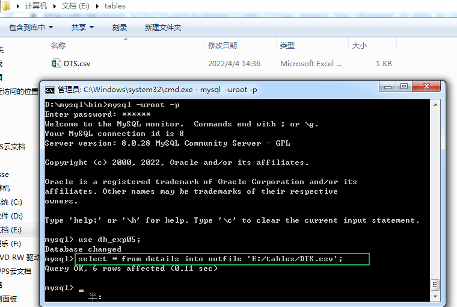
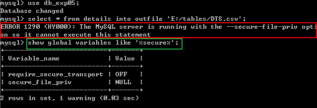
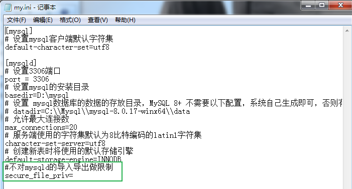
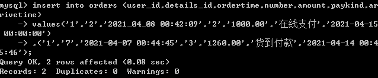
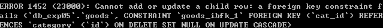
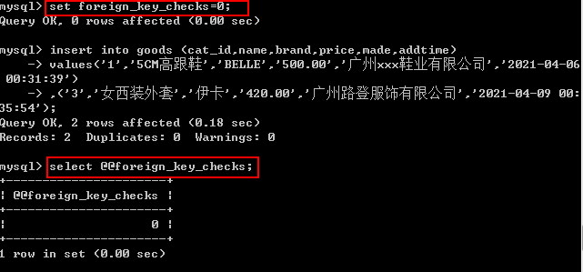
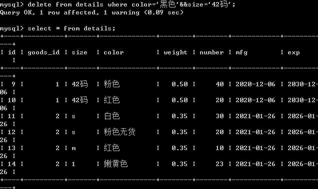
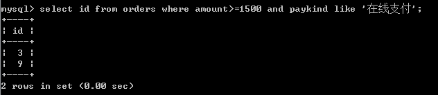
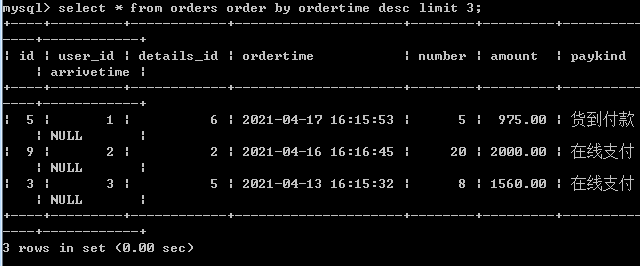

**MySQL压缩包安装**

将压缩包解压到D盘


在mysql安装目录下手动创建my.ini文件并填入以下内容

```shell
[mysql]
# 设置mysql客户端默认字符集
default-character-set=utf8
[mysqld]
# 设置3306端口
port = 3306
# 设置mysql的安装目录
basedir=D:\\mysql-8.0.28-winx64
# 设置 mysql数据库的数据的存放目录，MySQL 8+ 不需要以下配置，系统将自动生成data
# datadir=D:\\mysql-8.0.28-winx64\\data
# 允许最大连接数
max_connections=20
# 服务端使用的字符集默认为8比特编码的latin1字符集
character-set-server=utf8
# 创建新表时将使用的默认存储引擎
default-storage-engine=INNODB
```

配置环境变量

将mysql下的bin文件夹的绝对路径复制到系统变量中的path中


以管理员身份打开cmd，初始化mysql，mysql8.0之后自动生成data文件夹。

```mysql
mysqld  --initialize-insecure //初始化mysql,但暂不设置root密码
```


初始化后mysql安装目录下将产生data文件，里面存放着mysql初始的数据库


```mysql
mysqld install mysql	//安装mysql服务
```


登录mysql

```mysql
//免密码登录mysql
mysql -uroot

//切换数据库
use mysql;
 
//修改root用户的密码为123456，根据需要自己设置
alter user 'root'@localhost identified by '123456';
 
//刷新权限,修改密码或授权用户后必须要使用才可退出mysql,不然会导致进入不了mysql
flush privileges;
 
//退出mysql
quit 或 exit
```


```mysql
mysql -uroot -p	//之后输入密码，使用mysql
```

注意：

图形化界面连接mysql时可能出现mysqli_real_connect(): The server requested authentication method unknown to the client [caching_sha2_password]报错。


解决办法：

1.升级图形化界面版本（推荐）

2.更改数据库root用户的加密方式

```mysql
alter user 'root'@localhost identified with mysql_native_password BY '123456';
```


即可成功登录图形化界面


---

**mysql创建数据库**

进入mysql后查看有哪些数据库

```mysql
show databases;
```


创建数据库

```mysql
create database db_exp07 character set=utf8 collate=utf8_general_ci;
//character set 用于指定数据库的字符集
//collate 用于指定字符集的校对规则
//字符集和校对规则是一对多的关系，每个字符集都有一个默认的校对规则，一般情况下，没有特殊需求，只设置其一即可。若都不设置则默认my.ini文件中指定方式
```


```mysql
mysql> create database db_admin;//创建一个名为db_admin的数据库
mysql> use db_admin;//选择数据库
//创建数据表
mysql> create table tb_productategory( 
	-> id int(10) auto_increment primary key not null comment'系统自动编号',
	-> name varchar(50> not null comment'类别名称',
    -> level int(11) null comment'类别名称',
	-> pid int(11)null comment'父节点类型ID'); 
```

创建成功后用show或DESC命令查看表的结构

```mysql
show colunmns from tb_productategory;
desc tb_productategory;
```


查看当前数据库中有哪些表

```mysql
use db_product;
show tables;
```


删除数据表

```mysql
delete from 数据表;
truncate table 数据表;
```


组合主键

```mysql
create table abc(
id int(10) auto_increment not null commrnt'系统自动编号',
path varchar(225) not null comment'文件路径信息',
constraint primary key (id,path));	//设置组合主键
)
```


---

**导入.sql文件到数据库**

首先查看MySQL服务器配置信息

```mysql
show variables like '%char%';
```

更改字符集防止导入后出现乱码

```mysql
set names gbk;
//同时修改以下三个值
character_set_client
character_set_connection
character_set_results
```


查看当前 MySQL 使用的校对规则


导入.sql文件

```mysql
source /路径……/db_logistics.sql
```


**导出数据表（.csv）**

导出数据表中所有数据到.csv文件

```mysql
select * from 数据表 into outfile '路径';
```



导出时出现错误

"MySQL服务器正在运行--secure-file-priv选项，所以它不能执行这个语句"



解决办法

在my.ini文件中添加一行

```mysql
#不对mysqld的导入导出做限制
secure_file_priv=
```



重启MYSQL服务

再次查看设置，Value为空白即设置成功。


---

**更改数据库**

添加字段到数据表

```mysql
alter table 表名 add 字段 类型 ……;
```

同时添加多个字段

```mysql
alter table 表名 add (字段1 类型 …… ，字段2 类型 ……);
```


创建时间字段指定缺省值为插入记录时的系统日期和时间


设置数据表中字段唯一性

```mysql
alter table 数据表 add unique(字段); 
```


删除表中的字段

```mysql
alter table 表名 drop 字段名;
```


更改数据表名

```mysql
rename table 原表名 to 新表名;
```


给数据表中字段设置外键

```mysql
alter table 表名1 add foreign key(表名1中字段) references 表名2(表名2中字段);
```


---

**表数据的增、删、改、查操作**

**增**

对数据表插入数据

```mysql
insert into goods (字段1,字段2,字段3...) values('数据1','数据2','数据3');
```



若创建数据表时设置了外键出现以下错误



解决办法，暂时禁用外键

```mysql
set foreign_key_checks=0;
```

查看外键使用情况

```mysql
select @@foreign_key_checks;
```



---

**删**

带条件删除数据

```mysql
delete from 数据表 where 条件1 and 条件2;//and可用运算符&&代替
```



---

**改**

改变数据表某一字段中所有数据

```mysql
update 数据表 set 字段=字段*1.1;//将所有数据增加10%
```


带条件修改数据

```mysql
update 数据表 set 字段='...' where (条件);
```


---

**查**

基本语法

```mysql
select 字段 from 数据表名							//要查询的内容，指定数据表中的列
where primary_constraint					   //查询时行必须满足的条件
group by grouping_columns					   //如何对结果分组
order by sorting_cloumns					   //如何对结果进行排序
having secondary_constraint					   //查询时满足的第二条件
limit count									   //限定输出的查询结果
```

单表查询

查询符合条件的多列数据

```mysql
select 字段1,字段2,... from 数据表 where 条件1 and 条件2;
```



查询存在某些字符的数据，同时区分大小写

```mysql
select 字段1,字段2,... from 数据表 where binary like '%A%';
like-------匹配字符
binary-----区分大小写
%-----表示匹配多个字符
_ ----表示匹配单个字符
```


查询表中所有字段，将结果排序，显示前任意个数据

```mysql
select * from 数据表 order by 字段 desc limit 整数;
order by-----对查询结果排序，默认升序输出
desc---------降序排序
asc----------升序排序
limit -------限制查询结果的数量
```


