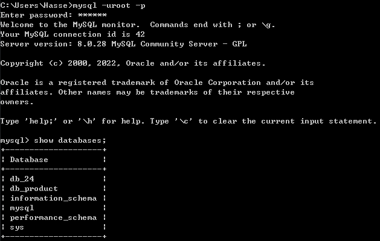
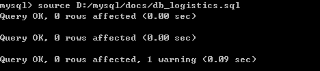

# MySQL笔记

[toc]

* [MySQL笔记](#mysql笔记)
  * [<strong>MySQL的安装</strong>](#mysql的安装)
    * [<strong>MySQL压缩包安装</strong>](#mysql压缩包安装)
  * [<strong>创建数据库和数据表</strong>](#创建数据库和数据表)
    * [<strong>创建数据库</strong>](#创建数据库)
    * [<strong>创建数据表</strong>](#创建数据表)
  * [<strong>数据库的导入导出</strong>](#数据库的导入导出)
    * [<strong>导入\.sql文件到数据库</strong>](#导入sql文件到数据库)
    * [<strong>导出数据表（\.csv）</strong>](#导出数据表csv)
  * [<strong>更改数据表结构</strong>](#更改数据表结构)
  * [<strong>表数据的增、删、改、查操作</strong>](#表数据的增删改查操作)
    * [<strong>增</strong>](#增)
    * [<strong>删</strong>](#删)
    * [<strong>改</strong>](#改)
    * [<strong>查</strong>](#查)
      * [<strong>单表查询</strong>](#单表查询)
        * [<strong>复合查询</strong>](#复合查询)
        * [<strong>带IN关键字的子查询</strong>](#带in关键字的子查询)
        * [<strong>分组查询</strong>](#分组查询)
      * [<strong>多表查询</strong>](#多表查询)
        * [<strong>内连接：</strong>](#内连接)
        * [<strong>左连接：</strong>](#左连接)
        * [<strong>右链接：</strong>](#右链接)
      * [<strong>使用正则表达式查询</strong>](#使用正则表达式查询)
  * [<strong>聚合函数</strong>](#聚合函数)
    * [<strong>数学函数</strong>](#数学函数)
    * [<strong>字符串函数</strong>](#字符串函数)
    * [<strong>日期和时间函数</strong>](#日期和时间函数)
    * [<strong>条件判断函数</strong>](#条件判断函数)
    * [<strong>系统信息函数</strong>](#系统信息函数)
    * [<strong>其它函数</strong>](#其它函数)
  * [<strong>索引</strong>](#索引)
    * [<strong>创建数据表时创建索引</strong>](#创建数据表时创建索引)
    * [<strong>已存在的数据表中创建数据表</strong>](#已存在的数据表中创建数据表)

    * [<strong>修改已存在在表上的索引</strong>](#修改已存在在表上的索引)
    * [<strong>删除索引</strong>](#删除索引)
  * [<strong>视图</strong>](#视图)
    * [<strong>创建视图</strong>](#创建视图)

## **MySQL的安装**

### **MySQL压缩包安装**

将压缩包解压到D盘


在mysql安装目录下手动创建my.ini文件并填入以下内容

```shell
[mysql]
# 设置mysql客户端默认字符集
default-character-set=utf8
[mysqld]
# 设置3306端口
port = 3306
# 设置mysql的安装目录
basedir=D:\\mysql-8.0.28-winx64
# 设置 mysql数据库的数据的存放目录，MySQL 8+ 不需要以下配置，系统将自动生成data
# datadir=D:\\mysql-8.0.28-winx64\\data
# 允许最大连接数
max_connections=20
# 服务端使用的字符集默认为8比特编码的latin1字符集
character-set-server=utf8
# 创建新表时将使用的默认存储引擎
default-storage-engine=INNODB
```

配置环境变量

将mysql下的bin文件夹的绝对路径复制到系统变量中的path中


以管理员身份打开cmd，初始化mysql，mysql8.0之后自动生成data文件夹。

```mysql
mysqld  --initialize-insecure //初始化mysql,但暂不设置root密码
```


初始化后mysql安装目录下将产生data文件，里面存放着mysql初始的数据库


```mysql
mysqld install mysql	//安装mysql服务
```


登录mysql

```mysql
//免密码登录mysql
mysql -uroot

//切换数据库
use mysql;
 
//修改root用户的密码为123456，根据需要自己设置
alter user 'root'@localhost identified by '123456';
 
//刷新权限,修改密码或授权用户后必须要使用才可退出mysql,不然会导致进入不了mysql
flush privileges;
 
//退出mysql
quit 或 exit
```


```mysql
mysql -uroot -p	//之后输入密码，使用mysql
```

注意：

图形化界面连接mysql时可能出现mysqli_real_connect(): The server requested authentication method unknown to the client [caching_sha2_password]报错。


解决办法：

1.升级图形化界面版本（推荐）

2.更改数据库root用户的加密方式

```mysql
alter user 'root'@localhost identified with mysql_native_password BY '123456';
```


即可成功登录图形化界面


---

## **创建数据库和数据表**

### **创建数据库**

```mysql
create database db_exp07 character set=utf8 collate=utf8_general_ci;
//character set 用于指定数据库的字符集
//collate 用于指定字符集的校对规则
//字符集和校对规则是一对多的关系，每个字符集都有一个默认的校对规则，一般情况下，没有特殊需求，只设置其一即可。若都不设置则默认my.ini文件中指定方式
```


进入mysql后查看有哪些数据库

```mysql
show databases;
```



### **创建数据表**

```mysql
mysql> create table tb_productategory( 
	-> id int(10) auto_increment primary key not null comment'系统自动编号',
	-> name varchar(50> not null comment'类别名称',
    -> level int(11) null comment'类别名称',
	-> pid int(11)null comment'父节点类型ID'); 
```

创建成功后用show或DESC命令查看表的结构

```mysql
show colunmns from tb_productategory;
desc tb_productategory;
```


 根据以下数据表写出创建数据表的SQL语句。

| 表名 | wm_pmix        |                |            |          |        |                                                              |
| ---- | -------------- | -------------- | ---------- | -------- | ------ | ------------------------------------------------------------ |
| 描述 | 产品构成信息表 |                |            |          |        |                                                              |
| 序号 | 字段           | 注释           | 类型及长度 | 允许空值 | 缺省值 | 其它说明                                                     |
| 1    | pmId           | 产品构成记录号 | int(11)    | 否       |        | 主键，自增                                                   |
| 2    | prNo           | 产品编号       | char(8)    | 否       |        | 外键，关联到wm_product表的prNo字段——删除时cascade，更新时cascade |
| 3    | paUnNo         | 零部件号       | char(8)    | 是       |        | 外键一，关联到wm_part表的paNo字段——删除时set null，更新时cascade；  外键二，关联到wm_unit表的unNo字段——删除时set null，更新时cascade； |
| 4    | pmNum          | 数量           | int(11)    | 否       | 1      |                                                              |


在创建时间字段的时候

```sql
DEFAULT CURRENT_TIMESTAMP
表示当插入数据的时候，该字段默认值为当前时间

ON UPDATE CURRENT_TIMESTAMP
表示每次更新这条数据的时候，该字段都会更新成当前时间
```

查看当前数据库中有哪些表

```mysql
use db_product;
show tables;
```


删除数据表

```mysql
delete from 数据表;
truncate table 数据表;
```


组合主键

```mysql
create table abc(
id int(10) auto_increment not null commrnt'系统自动编号',
path varchar(225) not null comment'文件路径信息',
constraint primary key (id,path));	//设置组合主键
)
```


组合主键和分别建立主键的区别

1.组合主键：两个字段一起建立唯一约束，数据库将两个字段值**合并**后验证唯一性。

2.分别建立主键：两个字段分别建立唯一约束，数据库**单独**验证每个字段中值的唯一性。

例如：关系R(a,b)的两个记录r1(1,2)和r2(1,3)，如果分别建立唯一性约束，这两个记录是不能同时存在的，但一起建立唯一约束则是可以同时存在的

---

## **数据库的导入导出**

### **导入.sql文件到数据库**

首先查看MySQL服务器配置信息

```mysql
show variables like '%char%';
```

更改字符集防止导入后出现乱码

```mysql
set names gbk;
//同时修改以下三个值
character_set_client
character_set_connection
character_set_results
```


查看当前 MySQL 使用的校对规则


导入.sql文件

```mysql
source /路径……/db_logistics.sql
```



### **导出数据表（.csv）**

导出数据表中所有数据到.csv文件

```mysql
select * from 数据表 into outfile '路径';
```


导出时出现错误

"MySQL服务器正在运行--secure-file-priv选项，所以它不能执行这个语句"


解决办法

在my.ini文件中添加一行

```mysql
#不对mysqld的导入导出做限制
secure_file_priv=
```


重启MYSQL服务

再次查看设置，Value为空白即设置成功。


---

## **更改数据表结构**

添加字段到数据表

```mysql
alter table 表名 add 字段 类型 ……;
```

同时添加多个字段

```mysql
alter table 表名 add (字段1 类型 …… ，字段2 类型 ……);
```


修改字段类型(数据类型，长度，默认值)

```sql
alter table user modify user_name 类型;
```

修改字段名

```sql
方法一：alter table 数据表 change 旧字段名  新字段名  新数据类型
例如：  alter table user change user_name user_name1 varchar(10)

方法二：alter table 数据表名 rename column z to x
例如：  alter table user rename column user_name to user_name1
```

创建时间字段指定缺省值为插入记录时的系统日期和时间


设置数据表中字段唯一性

```mysql
alter table 数据表 add unique(字段); 
```


删除表中的字段

```mysql
alter table 表名 drop 字段名;
```


更改数据表名

```mysql
rename table 原表名 to 新表名;
```


给数据表中字段设置外键

```mysql
alter table 表名1 add foreign key(表名1中字段) references 表名2(表名2中字段);
```


---

## **表数据的增、删、改、查操作**

### **增**

对数据表插入数据

```mysql
insert into goods (字段1,字段2,字段3...) values('数据1','数据2','数据3');
```


若创建数据表时设置了外键出现以下错误


解决办法，暂时禁用外键

```mysql
set foreign_key_checks=0;
```

查看外键使用情况

```mysql
select @@foreign_key_checks;
```


---

### **删**

带条件删除数据

```mysql
delete from 数据表 where 条件1 and 条件2;//and可用运算符&&代替
```


---

### **改**

改变数据表某一字段中所有数据

```mysql
update 数据表 set 字段=字段*1.1;//将所有数据增加10%
```


带条件修改数据

```mysql
update 数据表 set 字段='...' where (条件);
```


---

### **查**

基本语法

```mysql
select 字段 from 数据表名							//要查询的内容，指定数据表中的列
where primary_constraint					   //查询时行必须满足的条件
group by grouping_columns					   //如何对结果分组
order by sorting_cloumns					   //如何对结果进行排序
having secondary_constraint					   //查询时满足的第二条件
limit count									   //限定输出的查询结果
```

#### **单表查询**

查询符合条件的多列数据

```mysql
select 字段1,字段2,... from 数据表 where 条件1 and 条件2;
```


合并查询结果

```sql
select 字段 from 数据表1
union
select 字段 from 数据表2;
//将两个结果集合并到一起
```

查询存在某些字符的数据，同时区分大小写

```mysql
select 字段1,字段2,... from 数据表 where binary like '%A%';
like-------匹配字符
binary-----区分大小写
%-----表示匹配多个字符
_ ----表示匹配单个字符
```


查询表中所有字段，将结果排序，显示前任意个数据

```mysql
select * from 数据表 order by 字段 desc limit 整数;
order by-----对查询结果排序，默认升序输出
desc---------降序排序
asc----------升序排序
limit -------限制查询结果的数量
```


**limit**如果给定两个参数，第一个参数指定第一个返回记录行的**偏移量（第几个开始）**，第二个参数指定返回记录行的**最大数目**。**初始记录行的偏移量是 0**(而不是 1)。


##### **复合查询**

```sql
select 字段1，字段2…… from 数据表1 where 字段=(select 字段 from 数据表2);
```


##### **带IN关键字的子查询**

IN运算符可以检测结果集中是否存在某个特定的值，如果检测成功则执行外部的查询。

```sql
select 字段1，字段2…… from 数据表1 where 字段 in (select 字段 from 数据表2);
```

##### **分组查询**

将查询结果按照一个或多个字段进行分组，字段值相同的为一组。

以下例子中，更据paykind字段分组，paykind字段只有（'货到付款'和'在线支付'）所以分为两组。

```sql
select 字段1,字段2 from 数据表1 
group by 字段1
with rollup;
```

**WITH ROLLUP**：在group by分组字段的基础上，另起一行进行数据汇总统计。

效果：产生以下图片的合计一行


having子句

```sql
select 字段1,字段2 from 数据表1 
where 条件1
group by 字段1
having 条件2;
```


**WHERE子句与HAVING子句的区别。**

1.作用对象不同，where作用于表或视图，having作用于组。

2.执行顺序不同执行时先找出符合where条件，再分组，分组后再判断having条件

3.where中不能使用聚合函数，having中可以，having跟group by 连在一起使用

---

#### **多表查询**

##### **内连接：**

返回两个表中联结字段相等的数据，取交集的部分。


```sql
语法一：
select 字段1,字段2 from 数据表1
inner join 数据表2 on 数据表1.字段=数据表2.字段
group by 数据表.字段1
having 条件2;
```

```sql
语法二（简写）：
select 字段1,字段2 from 数据表1,数据表2
where 数据表1.字段=数据表2.字段
group by 数据表.字段1
having 条件2;
```


##### **左连接：**

返回左表中所有记录和右表中联结字段相等的记录，左表全部的数据加上交集的数据。


```sql
select 字段1,字段2 from 数据表1（左表）
left join 数据表2（右表） on 数据表1.字段=数据表2.字段
group by 数据表.字段1
having 条件2;
```

##### **右链接：**

返回右表中所有记录和左表中联结字段相等的记录，右表全部的数据加上交集的数据。


```sql
select 字段1,字段2 from 数据表1（左表）
right join 数据表2（右表） on 数据表1.字段=数据表2.字段
group by 数据表.字段1
having 条件2;
```

---

#### **使用正则表达式查询**

```sql
select * from 数据表 where 字段 regexp '匹配方式';
```

`^`含义：匹配特定字符或字符串开头的记录。

`$`含义：匹配特定字符或字符串结尾的记录。

`.`含义：匹配任意一个字符

`[字符集合]`含义：例"[abc]"，匹配abc任意一个字符

`[^字符集合]`含义：匹配字符集合**以外**的任意一个字符

`s1|s2|s3`含义：匹配s1、s2、s3中任意一个字符串

`*`含义：匹配多个该符号之前的字符，包括0个或1个。

​		例：'J*A'，匹配A字符前出现过J字符的记录

`+`含义：匹配多个该符号之前的字符，包括1个。

​		例：'J+A'，匹配A字符前面至少出现过一个J字符的记录

`字符串{N}`含义：匹配字符串出现N次。

​		例：'a{3}'，匹配连续出现3次a的字符记录

`字符串{M,N}`含义：匹配字符串出现至少M次，最多N次。

​		例：'a{2,4}'，匹配最少出现2次，最多出现4次a字符的记录。

正则表达式大全：https://github.com/any86/any-rule

---

## **聚合函数**

### **数学函数**

ABS(x)函数用于求绝对值。


FLOOR(x)函数返回小于或等于x的最大整数


RAND()函数返回0~1之间的随机数


PI()函数用于返回圆周率


TRUNCATE(x,y)函数返回x保留到小数点后y位的值


ROUND(x)函数返回离x最近的整数，即对x进行四舍五入。

ROUND(x，y)函数返回x保留到小数点后y位，截断式四舍五入。


SQRT(x)函数用于求平方根。


### **字符串函数**

INSERT(s1,x,len,s2)函数将字符串s1中x位置开始，长度为len的字符串用字符串s2替代。


UPPER(s)和UCASE(s)函数将字符串s的所有字母转换成大写字母。


LEFT(s,n)函数返回字符串s的前n个字符。


RTRIM(s)函数去掉字符串s结尾处的空格。


SUBSTRING(s,n,len)函数从字符串s的第n个位置开始获取长度为len的字符串。


REVERSE(s)函数将字符串s的顺序反过来。


FIELD(s,s1,s2,……)函数返回第一个与字符串S匹配的字符串的位置。


获取子字符串相匹配的开始位置。

（1）LOCATE(s1,s)表示子字符串s1在字符串s中的开始位置。

（2）POSITION(s1 IN s)表示子字符串s1在字符串s中的开始位置。

（3）INSTR(s,s1)表示子字符串s1在字符串s中的开始位置。


### **日期和时间函数**

CURDATE()和CURRENT_DATE()函数用于获取当前日期。


CURTIME()和CURRENT_TIME()函数用于获取当前时间。


NOW()函数用于获取当前日期和时间。

类似函数有：CURRENT_TIMESTAMP()、LOCALTIME()、SYSDATE()、LOCALTIMESTAMP()。


DATEDIFF(d1,d2)函数用于计算日期d1与d2之间相隔的天数。


ADDDATE(d,n)函数返回起始日期d加上n天的日期。


ADDDATE(d,INTERVAL,expr type)函数返回起始日期d加上一个时间段后的日期。


SUBDATE(d,n)函数返回起始日期d减去n天的日期。


### **条件判断函数**

```sql
IF(expr,v1,v2) //如果表达式expr成立，则执行v1，否则执行v2。

IFNULL(v1,v2) //如果v1不为空，则显示v1的值，否则显示v2的值。

CASE WHEN exxpr1 THEN v1 [WHEN expr2 THEN v2 ……] [ELSE vn] END //与switch语句类似。
```

### **系统信息函数**

1.获取MySQL版本号、连接数和数据库名的函数。

VERSION()函数返回数据库的版本号。

CONNECTION_ID()函数返回服务器的连接数，即到现在为止MySQL服务的连接次数。

DATABASE()和SCHEMA()函数返回当前数据库名。


2.获取用户名的函数

USER()、SYSTEM_USER()、SESSION_USER()、CURRENT_USER()、CURRENT_USER

函数可以返回当前用户名称。

3.获取字符串的字符集合排序方式的函数

CHARSET(str)函数返回字符串str的字符集。

COLLATION(str)函数返回字符串str的字符排列方式。


### **其它函数**

格式化函数

FORMAT(x,n)函数可以将数字x进行格式化，将保留到小数点后n位并且四舍五入。


改变字符集的函数

CONVERT(s USING cs)函数将字符串s的字符集变成字符集cs。


coalesce(a,b,c,……)函数

```sql
coalesce(a,b,c)
参数说明：
如果a==null,则选择b;如果b==null,则选择c;如果a!=null,则选择a;
如果a b c 都为null，则返回为null（没意义）。
```

---

## **索引**

意义：索引由数据表中一列或多列组合而成。目的是优化数据库的查询速度。

### **创建数据表时创建索引**

```sql
create table tb_productategory( 
id int(10) auto_increment primary key not null comment'系统自动编号',
name varchar(50) not null comment'类别名称',
level int(11) null comment'类别名称',
pid int(11)null comment'父节点类型ID'),
index(id),//创建普通索引
unique index index_name(id),//创建唯一索引,index_name索引的名称可以任取
fulltext key  index_name(level),//创建全文索引，全文索引只能创建在char、varchar、text类型字段上
index index_name(name(20))//创建单列索引
index index_name(name,pid)//创建多列索引
spatial index index_name(level)//创建空间索引
```

### **已存在的数据表中创建数据表**

```sql
//基本语法
create [unique|fulltext|spatial] index index_name
on table_name(属性,[(length)[ASC|DESC]]);
//length:用于指定索引长度
```

创建普通索引

```sql
create index 索引名 on 数据表名(字段名称);
```

创建唯一索引

```sql
create unique index 索引名 on 数据表名(字段名称);
```

创建全文索引

```sql
create fulltext index 索引名 on 数据表名(字段名称);
```

创建单列索引

```sql
create index 索引名 on 数据表名(字段名称(长度));
```

创建多列索引

```sql
create index 索引名 on 数据表名(字段1,字段2,……);
```

创建空间索引

```sql
create spatial index 索引名 on 数据表名(字段名称);
```

### **修改已存在在表上的索引**

```sql
//基本语法
alter table table_name add [unique|fulltext|spatial] index index_name(属性名 [(length)[ASC|DESC]]);
```

添加普通索引

```sql
alter table 数据表名 add index 索引名(字段);
```

添加唯一索引

```sql
alter table 数据表名 add unique index 索引名(字段);
```

添加全文索引

```sql
alter table 数据表名 add fulltext index 索引名(字段);
```

添加单列索引

```sql
alter table 数据表名 add index 索引名(字段(长度));
```

添加多列索引

```sql
alter table 数据表名 add index 索引名(字段1,字段2,……);
```

添加空间 索引

```sql
alter table 数据表名 add spatial index 索引名(字段);
```

### **删除索引**

```sql
drop index index_name on table_name;
```

---

## **视图**

意义：视图是一个虚拟表，其内容由查询定义，方便用户对数据的操作。创建视图后不必每次操作都执行视图的查询语句，简化操作。

### **创建视图**

```sql
create view 视图名称 as
select * from table_name ;
```


