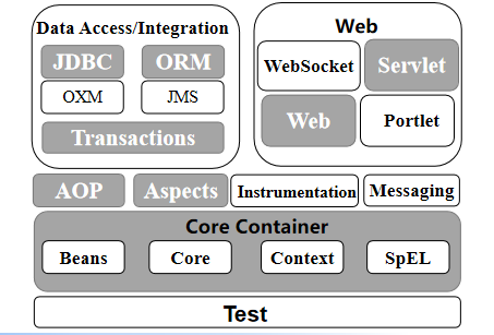
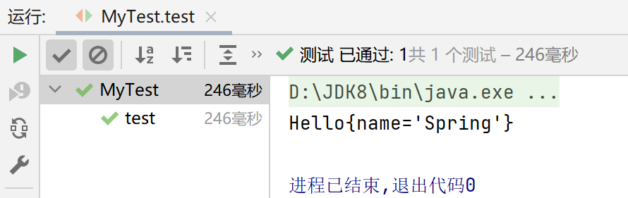
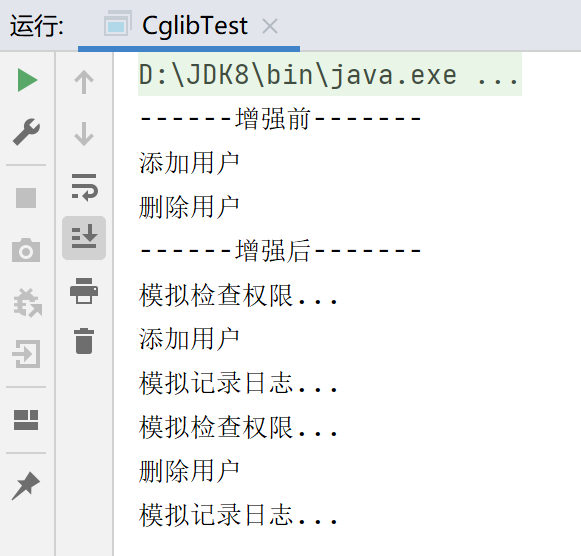
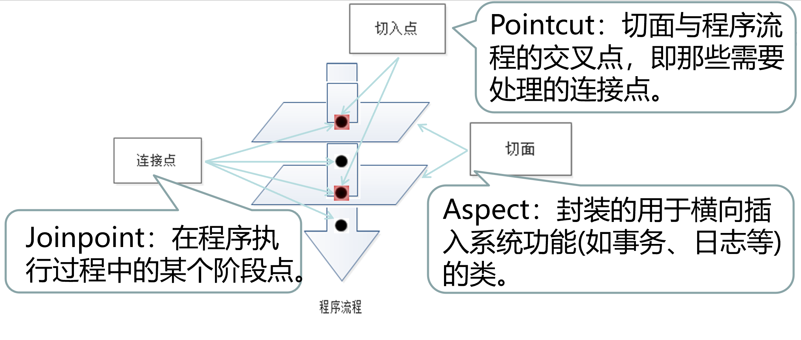
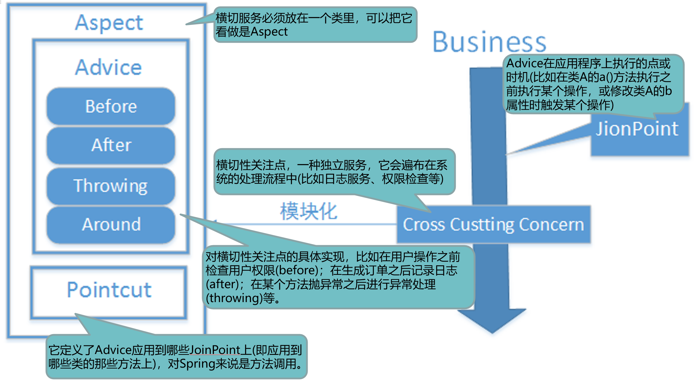
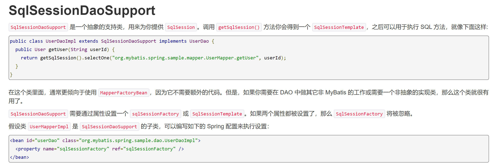
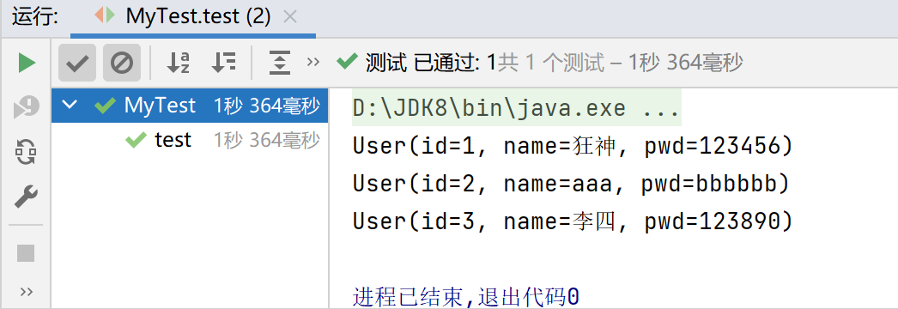

# Spring笔记

### 详细查看：[【官方文档】](https://docs.spring.io/spring-framework/docs/current/reference/html/core.html)

## Spring简介

**Spring是一个轻量级的控制反转(IOC)和面向切面(AOP)的容器(框架)。**

> 组成

灰色背景模块为所涉及的主要模块



## 控制反转（IoC）

> 什么是控制反转？

- **控制反转IoC(Inversion of Control)，是一种设计思想，依赖注入DI（Dependency Injection）是实现IoC的一种方法。**
- **控制反转是一种通过描述（XML或注解）并通过第三方去生产或获取特定对象的方式。在Spring中实现控制反转的是IoC容器，其实现方法是依赖注入。**
- **面向对象编程中，对象的创建由程序员自己控制（new）。控制反转后将对象的创建转移给第三方（Spring容器）。**

## Spring入门程序

1、导包

```xml
<dependency>
    <groupId>org.springframework</groupId>
    <artifactId>spring-webmvc</artifactId>
    <version>5.2.0.RELEASE</version>
</dependency>
```

2、编写实体类

```java
public class Hello {
    private String name;
    public Hello(){}
    public Hello(String name){
        this.name = name;
    }
    public String getName() {
        return name;
    }
    public void setName(String name) {
        this.name = name;
    }
    public void show(){
        System.out.println("Hello"+name);
    }
    @Override
    public String toString() {
        return "Hello{" +
                "name='" + name + '\'' +
                '}';
    }
}
```

3、编写applicationContext.xml配置文件

```xml
<?xml version="1.0" encoding="UTF-8"?>
<beans xmlns="http://www.springframework.org/schema/beans"
       xmlns:xsi="http://www.w3.org/2001/XMLSchema-instance"
       xsi:schemaLocation="
        http://www.springframework.org/schema/beans 
        http://www.springframework.org/schema/beans/spring-beans.xsd">

    <!--无参构造创建hello对象-->
    <bean id="hello" class="com.kuang.pojo.Hello">
        <!--set方法注入值-->
        <property name="name" value="Spring"/>
    </bean>
    <!--下标赋值-->
    <bean id="hello_index" class="com.kuang.pojo.Hello">
        <constructor-arg index="0" value="狂神说Java"/>
    </bean>

    <!--类型赋值,不建议使用-->
    <bean id="hello_type" class="com.kuang.pojo.Hello">
        <constructor-arg type="java.lang.String" value="newone"/>
    </bean>

    <!--通过参数名来设置-->
    <bean id="hello_param" class="com.kuang.pojo.Hello">
        <constructor-arg name="name" value="NewOne"/>
    </bean>

    <!--别名-->
    <alias name="hello" alias="helloAlias"/>

    <!--
        id:bean的唯一标识符，也就是相当于对象名
        class:bean对象所对应的全限定名：包名+类型
        name:也是别名,而且name可以取多个别名
    -->
    <bean id="hello2" class="com.kuang.pojo.Hello" name="h2,H2 HH;HHH">
        <property name="name" value="哈哈哈"/>
    </bean>
</beans>
```

4、编写测试类

```java
public class MyTest {
    @Test
    public void test(){
        //解析beans.xml文件，生成管理相应的Bean对象
        ApplicationContext context = new ClassPathXmlApplicationContext("applicationContext.xml");
        //getBean:参数即为spring配置文件中的bean的id
        Hello hello = (Hello)context.getBean("hello");
        System.out.println(hello.toString());
    }
}
```



## DI依赖注入

依赖注入 set注入

依赖：bean对象的创建依赖于容器。

注入：bean对象中的所有属性，由容器来注入。

> 数据库实体

```java
public class Student {
    private String name;
    private Address address;
    private String[] books;
    private List<String> hobbys;
    private Map<String,String> card;
    private Set<String> games;
    private String wife;
    private Properties info;
    //有参，无参构造
    //get,set方法
}
```

> applicationContext.xml配置

```xml
<?xml version="1.0" encoding="UTF-8"?>
<beans xmlns="http://www.springframework.org/schema/beans"
       xmlns:xsi="http://www.w3.org/2001/XMLSchema-instance"
       xsi:schemaLocation="
        http://www.springframework.org/schema/beans http://www.springframework.org/schema/beans/spring-beans.xsd">

    <!--引用类型注入 ref-->
    <bean id="address" class="com.kuang.pojo.Address">
        <property name="address" value="广州"/>
    </bean>

    <bean id="student" class="com.kuang.pojo.Student">
        <!--普通值注入-->
        <property name="name" value="NewOne"/>

        <!--引用类型注入 ref-->
        <property name="address" ref="address"/>

        <!--数组注入-->
        <property name="books">
            <array>
                <value>红楼梦</value>
                <value>西游记</value>
                <value>三国演义</value>
                <value>水浒传</value>
            </array>
        </property>

        <!--list集合注入-->
        <property name="hobbys">
            <list>
                <value>唱</value>
                <value>跳</value>
                <value>rap</value>
            </list>
        </property>

        <!--Map注入-->
        <property name="card">
            <map>
                <entry key="学生卡" value="0111293554"/>
            </map>
        </property>

        <!--Set注入-->
        <property name="games">
            <set>
                <value>小霸王</value>
                <value>超级玛丽</value>
                <value>黄金矿工</value>
            </set>
        </property>

        <!--null空值-->
        <property name="wife">
            <null/>
        </property>

        <!--Properties类型注入-->
        <property name="info">
            <props>
                <prop key="driver">109283</prop>
                <prop key="url">wdbbcc</prop>
                <prop key="username">root</prop>
                <prop key="password">123456</prop>
            </props>
        </property>
    </bean>
</beans>
```

> c命名空间与p命名空间

```xml
<!--p命名空间注入，可以直接注入属性的值：property-->
    <bean id="userP" class="com.kuang.pojo.User" p:name="newone" p:age="18"/>

    <!--c命名空间，通过构造器注入：construct-args-->
    <bean id="userC" class="com.kuang.pojo.User" c:name="NewOne" c:age="20" scope="prototype"/>

```

### 自动装配（AutoWired）

Spring中bean有三种装配机制，分别是：

1. 在xml中显式配置
2. 在java中显式配置
3. 隐式的bean发现机制和自动装配

Spring的自动装配需要从两个角度来实现，或者说是两个操作：

1. 组件扫描(component scanning)：spring会自动发现应用上下文中所创建的bean；
2. 自动装配(autowiring)：spring自动满足bean之间的依赖，也就是我们说的IoC/DI；

组件扫描和自动装配组合发挥巨大威力，使得显示的配置降低到最少。

---

> 实体

```java
public class People {
    private Dog dog;
    private Cat cat;
    private String name;
}
```

> xml显式配置

```xml-dtd
<bean id="dog" class="com.kuang.pojo.Dog"/>
<bean id="cat" class="com.kuang.pojo.Cat"/>

<bean id="people" class="com.kuang.pojo.People">
   <property name="cat" ref="cat"/>
   <property name="dog" ref="dog"/>
   <property name="name" value="NewOne"/>
</bean>
```

与下面的byName和byType效果一样

> byName

**autowired byName(按名称自动装配)**

byName:会自动在容器上下文中查找，和自己对象set方法后面的值的bean id

当一个bean节点带有 autowire byName的属性时。

1. 将查找其类中所有的set方法名，例如setCat，获得将set去掉并且首字母小写的字符串，即cat。
2. 去spring容器中寻找是否有此字符串名称id的对象。
3. 如果有，就取出注入；如果没有，就报空指针异常。

```java
<bean id="people" class="com.kuang.pojo.People" autowire="byName">
   <property name="name" value="NewOne"/>
</bean>
```

> byType

**autowire byType (按类型自动装配)**

byType:会自动在容器上下文中查找，和自己对象属性类相同的bean

```xml
<bean id="dog" class="com.kuang.pojo.Dog"/>
<!--有两个类型为Cat的bean,会报异常：NoUniqueBeanDefinitionException-->
<bean id="cat" class="com.kuang.pojo.Cat"/>
<bean id="cat2" class="com.kuang.pojo.Cat"/>

<bean id="people" class="com.kuang.pojo.People" autowire="byType">
   <property name="name" value="NewOne"/>
</bean>
```

---

#### 推荐：基于注解（Annotation）的装配

1、在spring配置文件中引入context文件头

```xml
xmlns:context="http://www.springframework.org/schema/context"

http://www.springframework.org/schema/context
http://www.springframework.org/schema/context/spring-context.xsd
```

2、开启属性注解支持！

```xml
<context:annotation-config/>
```

---

#### @Autowired

- @Autowired是按类型自动转配的，不支持id匹配。
- 需要导入 spring-aop的包！

1、将People类中的set方法也可以去掉，使用@Autowired注解

```java
public class People {
   //如果显示定义了Autowired的required属性为false,说明这个对象可以为null，true则不允许为空
   @Autowired(required = false)
   private Cat cat;
   @Autowired
   private Dog dog;
   private String name;

   public Cat getCat() {
       return cat;
  }
   public Dog getDog() {
       return dog;
  }
   public String getName() {
       return name;
  }
}
```

2、此时配置文件内容

```xml
<context:annotation-config/>

<bean id="dog" class="com.kuang.pojo.Dog"/>
<bean id="cat" class="com.kuang.pojo.Cat"/>
<bean id="people" class="com.kuang.pojo.People"/>
```

---

#### @Qualifier

- @Autowired是根据类型自动装配的，加上@Qualifier则可以根据byName的方式自动装配
- @Qualifier不能单独使用。

测试实验步骤：

1、配置文件修改内容，保证类型存在对象。且名字不为类的默认名字！

```xml
<bean id="dog1" class="com.kuang.pojo.Dog"/>
<bean id="dog2" class="com.kuang.pojo.Dog"/>
<bean id="cat1" class="com.kuang.pojo.Cat"/>
<bean id="cat2" class="com.kuang.pojo.Cat"/>
```

2、没有加Qualifier测试，直接报错

3、在属性上添加Qualifier注解

```java
@Autowired
@Qualifier(value = "cat2")
private Cat cat;
@Autowired
@Qualifier(value = "dog2")
private Dog dog;
```

测试，成功输出！

---

#### @Resource

- @Resource如有指定的name属性，先按该属性进行byName方式查找装配；
- 其次再进行默认的byName方式进行装配；
- 如果以上都不成功，则按byType的方式自动装配。
- 都不成功，则报异常。

实体类：

```java
public class People {
   @Resource(name = "cat2")
   private Cat cat;
   @Resource
   private Dog dog;
   private String name;
}
```

beans.xml

```xml
<bean id="dog" class="com.kuang.pojo.Dog"/>
<bean id="cat1" class="com.kuang.pojo.Cat"/>
<bean id="cat2" class="com.kuang.pojo.Cat"/>

<bean id="people" class="com.kuang.pojo.People"/>
```

测试：结果OK

> byName失败，使用byType

配置文件2：beans.xml ， 删掉cat2

```xml
<bean id="dog" class="com.kuang.pojo.Dog"/>
<bean id="cat1" class="com.kuang.pojo.Cat"/>
```

实体类上只保留注解

```java
@Resource
private Cat cat;
@Resource
private Dog dog;
```

结果：OK

**结论：先进行byName查找，失败；再进行byType查找，成功。**

---

## 使用注解开发

### Bean的注解实现

1、配置扫描哪些包下的注解

> applicationContext.xml配置

```xml
<?xml version="1.0" encoding="UTF-8"?>
<beans xmlns="http://www.springframework.org/schema/beans"
       xmlns:xsi="http://www.w3.org/2001/XMLSchema-instance"
       xmlns:context="http://www.springframework.org/schema/context"
       xsi:schemaLocation="
        http://www.springframework.org/schema/beans
        http://www.springframework.org/schema/beans/spring-beans.xsd
        http://www.springframework.org/schema/context
        https://www.springframework.org/schema/context/spring-context.xsd">

    <!--使用注解实现自动装配-->
    <context:annotation-config/>
    <!--指定要扫描的包，这个包下的注解就会生效-->
    <context:component-scan base-package="com.kuang"/>

</beans>
```

2、在指定包下编写类，增加注解

> 实体类

```java
//等价于 <bean id="user" class="com.kuang.pojo.User"/>
//Component 组件
@Component
@Scope("prototype")
public class User {
    public String name;
    //相当于<property name="name" value="NewOne"/>
    @Value("NewOne")
    public void setName(String name) {
        this.name = name;
    }
}

```

3、测试

```java
@Test
public void test(){
   ApplicationContext applicationContext =
       new ClassPathXmlApplicationContext("beans.xml");
   User user = (User) applicationContext.getBean("user");
   System.out.println(user.name);
}
```

---

#### 属性注入

使用注解注入属性

1、可以不用提供set方法，直接在直接名上添加@value("值")

```java
@Component("user")
// 相当于配置文件中 <bean id="user" class="当前注解的类"/>
public class User {
   @Value("NewOne")
   // 相当于配置文件中 <property name="name" value="秦疆"/>
   public String name;
}
```

2、如果提供了set方法，在set方法上添加@value("值");

```java
@Component("user")
public class User {
   public String name;
   @Value("NewOne")
   public void setName(String name) {
       this.name = name;
  }
}
```

---

#### @Component三个衍生注解

为了更好的进行分层，Spring可以使用其它三个注解，功能一样，目前使用哪一个功能都一样。

- @Controller：web层
- @Service：service层
- @Repository：dao层

写上这些注解，就相当于将这个类交给Spring管理装配了！

---

#### @scope作用域

- singleton：默认的，Spring会采用**单例模式**创建这个对象。关闭工厂 ，所有的对象都会销毁。
- prototype：**多例模式**。关闭工厂 ，所有的对象不会销毁。内部的垃圾回收机制会回收

```java
@Controller("user")
@Scope("prototype")
public class User {
   @Value("秦疆")
   public String name;
}
```

## 代理模式

### 静态代理

- 使开发人员在编写业务逻辑时可以专心于核心业务，而不用过多的关注于其他业务逻辑的实现 
- 公共的业务由代理来完成 . 实现了业务的分工 
- 公共业务发生扩展时变得更加集中和方便 

缺点 :

- 类多了 , 多了代理类 , 工作量变大了 . 开发效率降低 .

我们想要静态代理的好处，又不想要静态代理的缺点，所以 , 就有了动态代理 !

### 动态代理

#### JDK动态代理

JDK动态代理是通过java.lang.reflect.Proxy 类来实现的，可以通过调用Proxy类的newProxyInstance()方法来创建代理对象。对于使用业务**接口的类**，Spring默认会使用JDK动态代理来实现AOP。非常简单，但有局限性，必须**实现一个或多个接口**。

其核心为java的**反射机制**。

**代码实现** 

抽象角色和真实角色和之前的一样！

> Rent . java 即抽象角色

```java
//抽象角色：租房
public interface Rent {
   public void rent();
}
```

> Host . java 即真实角色

```java
//真实角色: 房东，房东要出租房子
public class Host implements Rent{
   public void rent() {
       System.out.println("房屋出租");
  }
}
```

> ProxyInvocationHandler. java 即代理角色

```java
public class ProxyInvocationHandler implements InvocationHandler {
   private Rent rent;

   public void setRent(Rent rent) {
       this.rent = rent;
  }

   //生成代理类，重点是第二个参数，获取要代理的抽象角色！之前都是一个角色，现在可以代理一类角色
   public Object getProxy(){
       return Proxy.newProxyInstance(this.getClass().getClassLoader(),
               rent.getClass().getInterfaces(),this);
  }

   // proxy : 代理类 method : 代理类的调用处理程序的方法对象.
   // 处理代理实例上的方法调用并返回结果
   @Override
   public Object invoke(Object proxy, Method method, Object[] args) throws Throwable {
       seeHouse();
       //核心：本质利用反射实现！
       Object result = method.invoke(rent, args);
       fare();
       return result;
  }

   //看房
   public void seeHouse(){
       System.out.println("带房客看房");
  }
   //收中介费
   public void fare(){
       System.out.println("收中介费");
  }

}
```

> Client . java

```java
//租客
public class Client {

   public static void main(String[] args) {
       //真实角色
       Host host = new Host();
       //代理实例的调用处理程序
       ProxyInvocationHandler pih = new ProxyInvocationHandler();
       pih.setRent(host); //将真实角色放置进去！
       Rent proxy = (Rent)pih.getProxy(); //动态生成对应的代理类！
       proxy.rent();
  }
}
```

**核心：一个动态代理 , 一般代理某一类业务 , 一个动态代理可以代理多个类，代理的是接口！**

---

#### CGLIB代理

如果想代理**没有实现接口的类**，那么可使用CGLIB代理。

CGLIB（Code Generation Library）是一个高性能开源的代码生成包，它采用非常底层的字节码技术，对指定的目标类生成一个子类，并对子类进行增强。

**代码实现** 

> User业务

```java
public class UserDao {
    public void addUser(){
        System.out.println("添加用户");
    }
    public void deleteUser(){
        System.out.println("删除用户");
    }
}
```

> MyAspect

```java
public class MyAspect {
    public void check_Permissions(){
        System.out.println("模拟检查权限...");
    }
    public void log(){
        System.out.println("模拟记录日志...");
    }
}
```

> CglibProxy代理类

```java
public class CglibProxy implements MethodInterceptor {
    // 代理方法
    public Object createProxy(Object target) {
        // 创建一个动态类对象
        Enhancer enhancer = new Enhancer();
        // 确定需要增强的类，设置其父类
        enhancer.setSuperclass(target.getClass());
        // 添加回调函数
        enhancer.setCallback(this);
        // 返回创建的代理类
        return enhancer.create();
    }
    /**
     * proxy CGlib根据指定父类生成的代理对象
     * method 拦截的方法
     * args 拦截方法的参数数组
     * methodProxy 方法的代理对象，用于执行父类的方法
     */
    @Override
    public Object intercept(Object proxy, Method method, Object[] args,
                            MethodProxy methodProxy) throws Throwable {
        // 创建切面类对象
        MyAspect myAspect = new MyAspect();
        // 前增强
        myAspect.check_Permissions();
        // 目标方法执行
        Object obj = methodProxy.invokeSuper(proxy,args);
        // 后增强
        myAspect.log();
        return obj;
    }
}
```

> 测试类

```java
public class CglibTest {
    public static void main(String[] args) {
        // 创建代理对象
        CglibProxy cglibProxy = new CglibProxy();
        // 创建目标对象
        UserDao userDao = new UserDao();
        System.out.println("------增强前-------");
        userDao.addUser();
        userDao.deleteUser();
        // 获取增强后的目标对象
        System.out.println("------增强后-------");
        UserDao userDao1 = (UserDao)cglibProxy.createProxy(userDao);
        // 执行方法
        userDao1.addUser();
        userDao1.deleteUser();
    }
}
```



## AOP

> 什么是AOP ?

AOP（Aspect Oriented Programming）意为：**面向切面编程**，通过预编译方式和运行期动态代理实现程序功能的统一维护的一种技术。AOP是OOP的延续，是软件开发中的一个热点，也是Spring框架中的一个重要内容，是函数式编程的一种衍生范型。利用AOP可以对业务逻辑的各个部分进行隔离，从而使得业务逻辑各部分之间的耦合度降低，提高程序的可重用性，同时提高了开发的效率。

> AOP常用术语

| **名称** | **常用说明** |
| -------- | ------------ |
| **横切关注点** | 横切性关注点，一种独立服务，它会遍布在系统的处理流程中。如日志 , 安全 , 缓存 , 事务等等 .... |
| **切面(Aspect)**       | 横切关注点 被模块化 的特殊对象。一个关注点的模块化，可能会横切多个对象，**由切入点(Pointcut)以及相应的增强处理(Advice)组成。它是一个类。** |
| **通知(Advice)** | 对横切性关注点的具体实现，比如在用户操作之前检查用户权限(before)；在生成订单之后记录日志(after)；在某个方法抛异常之后进行异常处理(throwing)等。。**切面必须要完成的工作。即，它是类中的一个方法。** |
| **目标(Target)**   | 被一个或多个切面所通知的对象，需要添加**增强的目标类**，织入Advice的目标对象。**被通知的对象。** |
| **代理(Proxy)**               | **向目标对象应用通知之后创建的对象。** |
| **切入点(Pointcut)**                 | 切面与程序流程的交叉点，即那些需要处理的连接点。**切面通知 执行的 “地点”的定义** |
| **连接点(Joinpoint)**                | 程序执行过程中某个特定的点，如方法的调用，或者异常的抛出。在 Spring  AOP中，**连接点总是方法的调用，是与切入点匹配的执行点**。 |
| **织入(Weaving)**      | 将切面代码插入到目标对象上，从而生成代理对象的过程。 |
| **引入(Introduction)** | 在不修改类代码的前提下，为类**添加新的方法和属性。特殊的增强**，可以为目标类添加属性和方法。 |





### 使用Spring实现Aop

【重点】使用AOP织入，需要导入一个依赖包！

```xml
<dependency>
   <groupId>org.aspectj</groupId>
   <artifactId>aspectjweaver</artifactId>
   <version>1.9.4</version>
</dependency>
```

#### 第一种方式

**通过 Spring API 实现**

首先编写我们的业务接口和实现类

```java
public interface UserService {
   public void add();
   public void delete();
   public void update();
   public void search();
}
public class UserServiceImpl implements UserService{
   @Override
   public void add() {
       System.out.println("增加用户");
  }
   @Override
   public void delete() {
       System.out.println("删除用户");
  }
   @Override
   public void update() {
       System.out.println("更新用户");
  }
   @Override
   public void search() {
       System.out.println("查询用户");
  }
}
```

然后去写我们的增强类 , 我们编写两个 , 一个前置增强 一个后置增强

```java
public class Log implements MethodBeforeAdvice {
   //method : 要执行的目标对象的方法
   //objects : 被调用的方法的参数
   //Object : 目标对象
   @Override
   public void before(Method method, Object[] objects, Object o) throws Throwable {
       System.out.println( o.getClass().getName() + "的" + method.getName() + "方法被执行了");
  }
}
public class AfterLog implements AfterReturningAdvice {
   //returnValue 返回值
   //method被调用的方法
   //args 被调用的方法的对象的参数
   //target 被调用的目标对象
   @Override
   public void afterReturning(Object returnValue, Method method, Object[] args, Object target) throws Throwable {
       System.out.println("执行了" + target.getClass().getName()
       +"的"+method.getName()+"方法,"
       +"返回值："+returnValue);
  }
}
```

最后去spring的文件中注册 , 并实现aop切入实现 , 注意导入约束 .

```xml
<?xml version="1.0" encoding="UTF-8"?>
<beans xmlns="http://www.springframework.org/schema/beans"
      xmlns:xsi="http://www.w3.org/2001/XMLSchema-instance"
      xmlns:aop="http://www.springframework.org/schema/aop"
      xsi:schemaLocation="http://www.springframework.org/schema/beans
       http://www.springframework.org/schema/beans/spring-beans.xsd
       http://www.springframework.org/schema/aop
       http://www.springframework.org/schema/aop/spring-aop.xsd">

   <!--注册bean-->
   <bean id="userService" class="com.kuang.service.UserServiceImpl"/>
   <bean id="log" class="com.kuang.log.Log"/>
   <bean id="afterLog" class="com.kuang.log.AfterLog"/>

   <!--aop的配置-->
   <aop:config>
       <!--切入点 expression:表达式匹配要执行的方法-->
       <aop:pointcut id="pointcut" expression="execution(* com.kuang.service.UserServiceImpl.*(..))"/>
       <!--执行环绕; advice-ref执行方法 . pointcut-ref切入点-->
       <aop:advisor advice-ref="log" pointcut-ref="pointcut"/>
       <aop:advisor advice-ref="afterLog" pointcut-ref="pointcut"/>
   </aop:config>
</beans>
```

测试

```java
public class MyTest {
   @Test
   public void test(){
       ApplicationContext context = new ClassPathXmlApplicationContext("beans.xml");
       UserService userService = (UserService) context.getBean("userService");
       userService.search();
  }
}
```

---

#### 第二种方式

**自定义类来实现Aop**

目标业务类不变依旧是userServiceImpl

第一步 : 写我们自己的一个切入类

```java
public class DiyPointcut {
   public void before(){
       System.out.println("---------方法执行前---------");
  }
   public void after(){
       System.out.println("---------方法执行后---------");
  }
}
```

去spring中配置

```xml
<!--第二种方式自定义实现-->
<!--注册bean-->
<bean id="diy" class="com.kuang.config.DiyPointcut"/>

<!--aop的配置-->
<aop:config>
   <!--第二种方式：使用AOP的标签实现-->
   <aop:aspect ref="diy">
       <aop:pointcut id="diyPonitcut" expression="execution(* com.kuang.service.UserServiceImpl.*(..))"/>
       <aop:before pointcut-ref="diyPonitcut" method="before"/>
       <aop:after pointcut-ref="diyPonitcut" method="after"/>
   </aop:aspect>
</aop:config>
```

测试：

```java
public class MyTest {
   @Test
   public void test(){
       ApplicationContext context = new ClassPathXmlApplicationContext("beans.xml");
       UserService userService = (UserService) context.getBean("userService");
       userService.add();
  }
}
```

---

#### 第三种方式

**使用注解实现**

第一步：编写一个注解实现的增强类

```java
@Aspect
public class AnnotationPointcut {
   @Before("execution(* com.kuang.service.UserServiceImpl.*(..))")
   public void before(){
       System.out.println("---------方法执行前---------");
  }

   @After("execution(* com.kuang.service.UserServiceImpl.*(..))")
   public void after(){
       System.out.println("---------方法执行后---------");
  }

   @Around("execution(* com.kuang.service.UserServiceImpl.*(..))")
   public void around(ProceedingJoinPoint jp) throws Throwable {
       System.out.println("环绕前");
       System.out.println("签名:"+jp.getSignature());
       //执行目标方法proceed
       Object proceed = jp.proceed();
       System.out.println("环绕后");
       System.out.println(proceed);
  }
}
```

第二步：在Spring配置文件中，注册bean，并增加支持注解的配置

```xml
<!--第三种方式:注解实现-->
<bean id="annotationPointcut" class="com.kuang.config.AnnotationPointcut"/>
<aop:aspectj-autoproxy/>
```

aop:aspectj-autoproxy 说明:

```xml
通过aop命名空间的<aop:aspectj-autoproxy />声明自动为spring容器中那些配置@aspectJ切面的bean创建代理，织入切面。当然，spring 在内部依旧采用AnnotationAwareAspectJAutoProxyCreator进行自动代理的创建工作，但具体实现的细节已经被<aop:aspectj-autoproxy />隐藏起来了

<aop:aspectj-autoproxy />有一个proxy-target-class属性，默认为false，表示使用jdk动态代理织入增强，当配为<aop:aspectj-autoproxy  poxy-target-class="true"/>时，表示使用CGLib动态代理技术织入增强。不过即使proxy-target-class设置为false，如果目标类没有声明接口，则spring将自动使用CGLib动态代理。
```

**总结：Spring的Aop就是将公共的业务 (日志 , 安全等) 和领域业务结合起来 , 当执行领域业务时 , 将会把公共业务加进来 . 实现公共业务的重复利用 . 领域业务更纯粹 , 程序员专注领域业务 , 其本质还是动态代理 .** 

---

## MyBatis-Spring

[【官方文档】](http://www.mybatis.org/spring/zh/index.html)

#### **方式一**

> 导包

```xml
<dependency>
   <groupId>org.mybatis</groupId>
   <artifactId>mybatis-spring</artifactId>
   <version>2.0.2</version>
</dependency>
```

> 实体类

```java
import lombok.Data;

@Data
public class User {
    private int id;
    private String name;
    private String pwd;
}
```

> UserMapper接口

```java
public interface UserMapper {
    List<User> getUserList();
}
```

> UserMapper.xml

```xml
<?xml version="1.0" encoding="UTF-8" ?>
<!DOCTYPE mapper
        PUBLIC "-//mybatis.org//DTD Mapper 3.0//EN"
        "https://mybatis.org/dtd/mybatis-3-mapper.dtd">
<mapper namespace="com.kuang.mapper.UserMapper">
    <select id="getUserList" resultType="com.kuang.pojo.User">
        select * from mybatis.user
    </select>

</mapper>
```

> UserMapperImpl实现类

```java
public class UserMapperImpl implements UserMapper {

    //原来：所有操作都使用sqlSession来执行。现在：都使用SqlSessionTemplate
    private SqlSessionTemplate sqlSession;

    public void setSqlSession(SqlSessionTemplate sqlSession) {
        this.sqlSession = sqlSession;
    }

    @Override
    public List<User> getUserList() {
        UserMapper mapper = sqlSession.getMapper(UserMapper.class);
        return mapper.getUserList();
    }
}
```

> spring-dao.xml

```xml
<!--DataSource:使用Spring的数据源替换Mybatis的配置 c3p0 dbcp druid
Spring提供的JDBC:org.springframework.jdbc.datasource
-->
<bean id="datasource" class="org.springframework.jdbc.datasource.DriverManagerDataSource">
    <property name="driverClassName" value="com.mysql.cj.jdbc.Driver"/>
    <property name="url" value="jdbc:mysql://localhost:3306/mybatis?useSSL=true&amp;characterEncoding=UTF-8&amp;useUnicode=true&amp;serverTimezone=GMT&amp;allowPublicKeyRetrieval=true"/>
    <property name="username" value="root"/>
    <property name="password" value="123456"/>
</bean>

<!--sqlSessionFactory-->
<bean id="sqlSessionFactory" class="org.mybatis.spring.SqlSessionFactoryBean">
    <property name="dataSource" ref="datasource"/>
    <!--绑定Mybatis配置文件-->
    <property name="configLocation" value="classpath:mybatis-config.xml"/>
    <property name="mapperLocations" value="classpath:com/kuang/mapper/*.xml"/>
</bean>

<!--SqlSessionTemplate:就是我们使用的sqlSession-->
<bean id="sqlSession" class="org.mybatis.spring.SqlSessionTemplate">
    <!--只能使用构造器注入sqlSessionFactory,因为它没有set方法-->
    <constructor-arg index="0" ref="sqlSessionFactory"/>
</bean>
```

> mybatis-config.xml(可以不需要)

```xml
<?xml version="1.0" encoding="UTF-8" ?>
<!DOCTYPE configuration
        PUBLIC "-//mybatis.org//DTD Config 3.0//EN"
        "https://mybatis.org/dtd/mybatis-3-config.dtd">
<configuration>
    <typeAliases>
        <package name="com.kuang.pojo"/>
    </typeAliases>
</configuration>
```

> applicationContext.xml

```xml
<!--导入Mybatis配置-->
<import resource="spring-dao.xml"/>

<!--注册bean-->
<bean id="userMapper" class="com.kuang.mapper.UserMapperImpl">
    <property name="sqlSession" ref="sqlSession"/>
</bean>

<!--使用SqlSessionDaoSupport-->
<bean id="userMapper2" class="com.kuang.mapper.UserMapperImpl2">
    <property name="sqlSessionFactory" ref="sqlSessionFactory"/>
</bean>
```

> 测试

```java
public class MyTest {
    @Test
    public void test() throws IOException {
        ClassPathXmlApplicationContext context = new ClassPathXmlApplicationContext("applicationContext.xml");
        UserMapper userMapper = context.getBean("userMapper2", UserMapper.class);
        List<User> userList = userMapper.getUserList();
        for (User user : userList) {
            System.out.println(user);
        }
    }
}
```

---

#### 方式二

官方文档截图 :

dao继承Support类 , 直接利用 getSqlSession() 获得 , 然后直接注入SqlSessionFactory . 比起方式1 , 不需要管理SqlSessionTemplate , 而且对事务的支持更加友好 . 可跟踪源码查看。



> 将方式一的UserMapperImpl修改

```java
public class UserMapperImpl extends SqlSessionDaoSupport implements UserMapper{
    @Override
    public List<User> getUserList() {
        return getSqlSession().getMapper(UserMapper.class).getUserList();
    }
}
```

> 修改bean的配置

```xml
<bean id="userDao" class="com.kuang.dao.UserDaoImpl">
   <property name="sqlSessionFactory" ref="sqlSessionFactory" />
</bean>
```

> 测试

```java
@Test
public void test2(){
   ApplicationContext context = new ClassPathXmlApplicationContext("beans.xml");
   UserMapper mapper = (UserMapper) context.getBean("userDao");
   List<User> user = mapper.selectUser();
   System.out.println(user);
}
```



---

## 声明式事务

**事务(transaction)的四个属性ACID**

1. **原子性（atomicity）**

2. - 事务是原子性操作，由一系列动作组成，事务的原子性确保动作要么全部完成，要么完全不起作用

3. **一致性（consistency）**

4. - 一旦所有事务动作完成，事务就要被提交。数据和资源处于一种满足业务规则的一致性状态中

5. **隔离性（isolation）**

6. - 可能多个事务会同时处理相同的数据，因此每个事务都应该与其他事务隔离开来，防止数据损坏

7. **持久性（durability）**

8. - 事务一旦完成，无论系统发生什么错误，结果都不会受到影响。通常情况下，事务的结果被写到持久化存储器中

### Spring中的事务

**使用Spring管理事务，注意头文件的约束导入 : tx**

```xml
xmlns:tx="http://www.springframework.org/schema/tx"

http://www.springframework.org/schema/tx
http://www.springframework.org/schema/tx/spring-tx.xsd">
```

> applicationContext.xml

```xml
<!--DataSource:使用Spring的数据源替换Mybatis的配置 c3p0 dbcp druid
Spring提供的JDBC:org.springframework.jdbc.datasource
-->
<bean id="dataSource" class="org.springframework.jdbc.datasource.DriverManagerDataSource">
    <property name="driverClassName" value="com.mysql.cj.jdbc.Driver"/>
    <property name="url" value="jdbc:mysql://localhost:3306/mybatis?useSSL=true&amp;characterEncoding=UTF-8&amp;useUnicode=true&amp;serverTimezone=GMT&amp;allowPublicKeyRetrieval=true"/>
    <property name="username" value="root"/>
    <property name="password" value="123456"/>
</bean>

<!--sqlSessionFactory-->
<bean id="sqlSessionFactory" class="org.mybatis.spring.SqlSessionFactoryBean">
    <property name="dataSource" ref="dataSource"/>
    <!--绑定Mybatis配置文件-->
    <property name="configLocation" value="classpath:mybatis-config.xml"/>
    <property name="mapperLocations" value="classpath:com/kuang/mapper/*.xml"/>
</bean>

<!--配置声明式事务-->
<bean id="transactionManager" class="org.springframework.jdbc.datasource.DataSourceTransactionManager">
    <property name="dataSource" ref="dataSource"/>
</bean>

<!--结合AOP实现事务的织入-->
<!--配置事务通知-->
<tx:advice id="txAdvice" transaction-manager="transactionManager">
    <!--配置哪些方法使用什么样的事务,配置事务的传播特性-->
    <!--配置事务的传播特性：new propagation-->
    <tx:attributes>
        <tx:method name="add" propagation="REQUIRED"/>
        <tx:method name="query" read-only="true"/>
        <tx:method name="*" propagation="REQUIRED"/>
    </tx:attributes>
</tx:advice>

<!--配置aop织入事务-->
<aop:config>
    <aop:pointcut id="txPointCut" expression="execution(* com.kuang.mapper.*.*(..))"/>
    <aop:advisor advice-ref="txAdvice" pointcut-ref="txPointCut"/>
</aop:config>

<!--配置SqlSessionFactory bean-->
<bean id="userMapper" class="com.kuang.mapper.UserMapperImpl">
    <property name="sqlSessionFactory" ref="sqlSessionFactory"/>
</bean>
```

