# SpringBlade

## 一、环境搭建

> 1. 拉取 GitHub 仓库

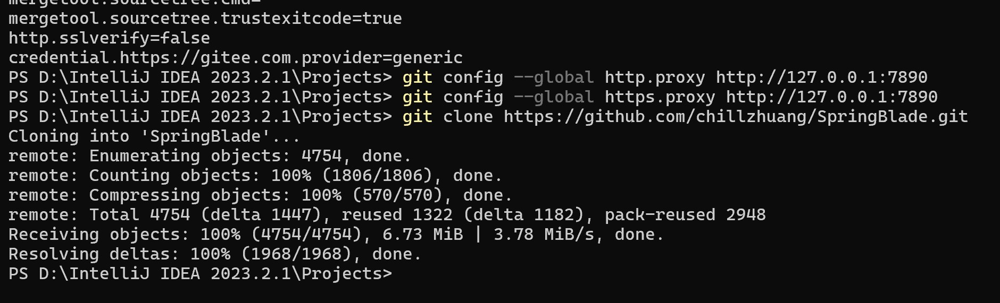

> 2. 单机启动 Nacos 


配置blade.yaml, blade-dev.yaml, blade-flow-dev.yaml。

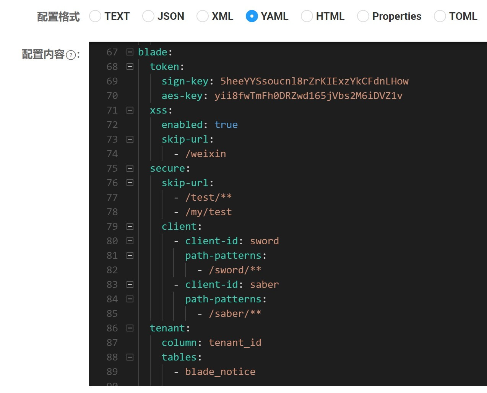

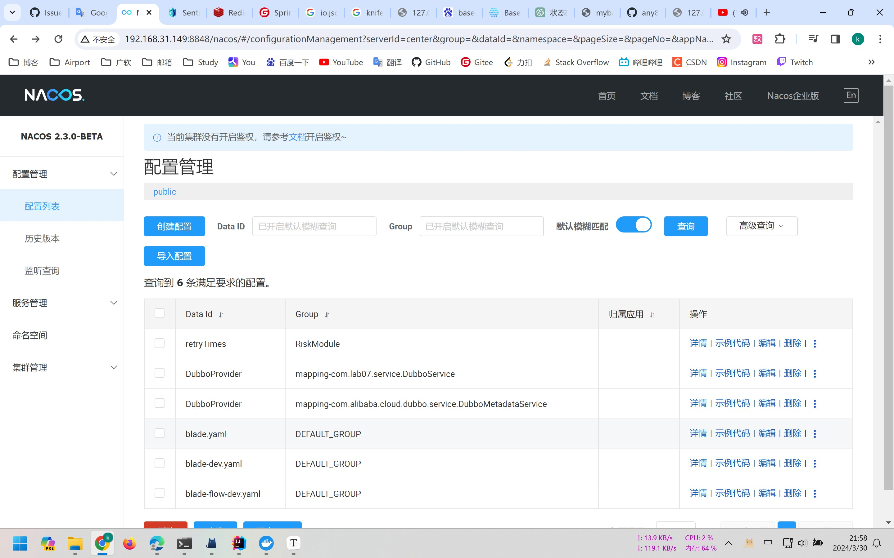

> 3. 启动 Sentinel 

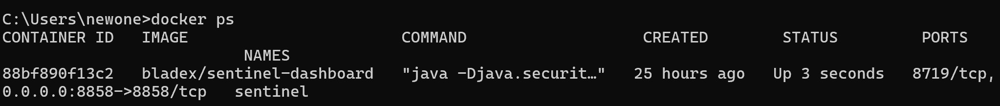


> 4. 启动 Redis 

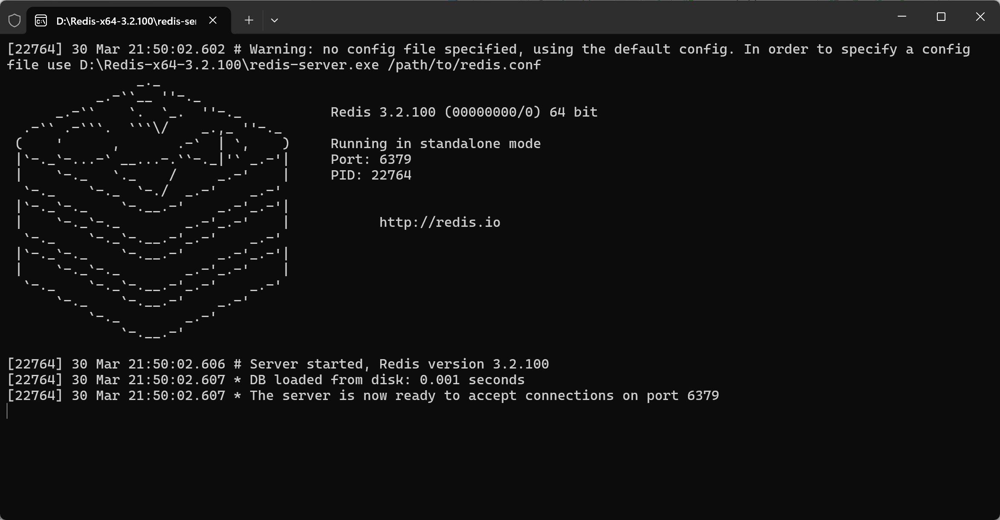

## 二、配置项目运行

> 1. 创建测试数据库

```sql
CREATE TABLE `blade_my` (
  `id` int NOT NULL AUTO_INCREMENT,
  `my_name` varchar(30) DEFAULT NULL,
  `my_phone` varchar(120) DEFAULT NULL,
  `is_deleted` int NOT NULL DEFAULT '0' COMMENT "已删除: 1, 未删除: 0",
  `create_time` datetime NOT NULL DEFAULT CURRENT_TIMESTAMP,
  `update_time` datetime NOT NULL DEFAULT CURRENT_TIMESTAMP,
  UNIQUE KEY `id` (`id`) USING BTREE,
  UNIQUE KEY `uk_name` (`my_name`) USING BTREE
) ENGINE=InnoDB AUTO_INCREMENT=2 DEFAULT CHARSET=utf8mb4 COLLATE=utf8mb4_general_ci;
```

> 2. 新建模块

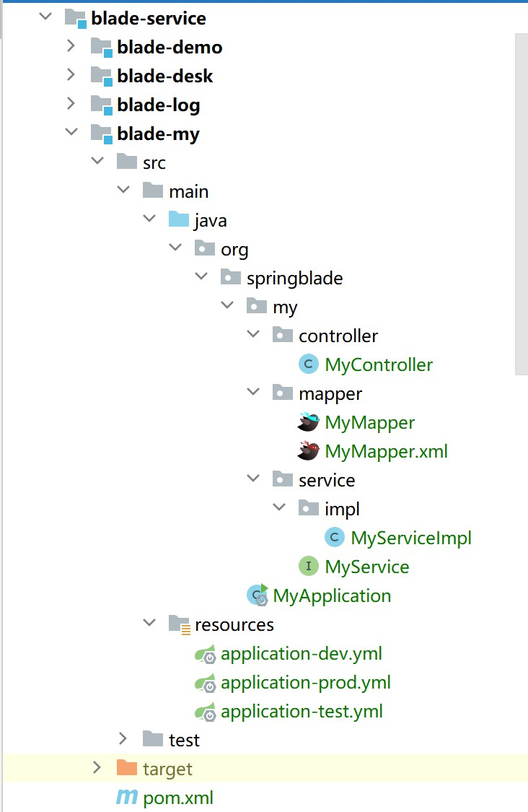

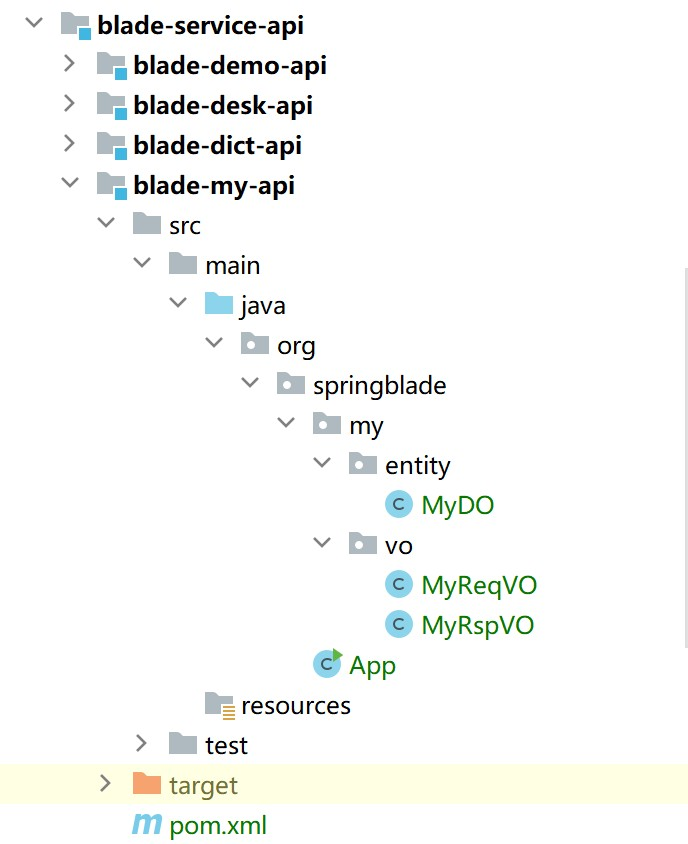

> 3. 运行项目

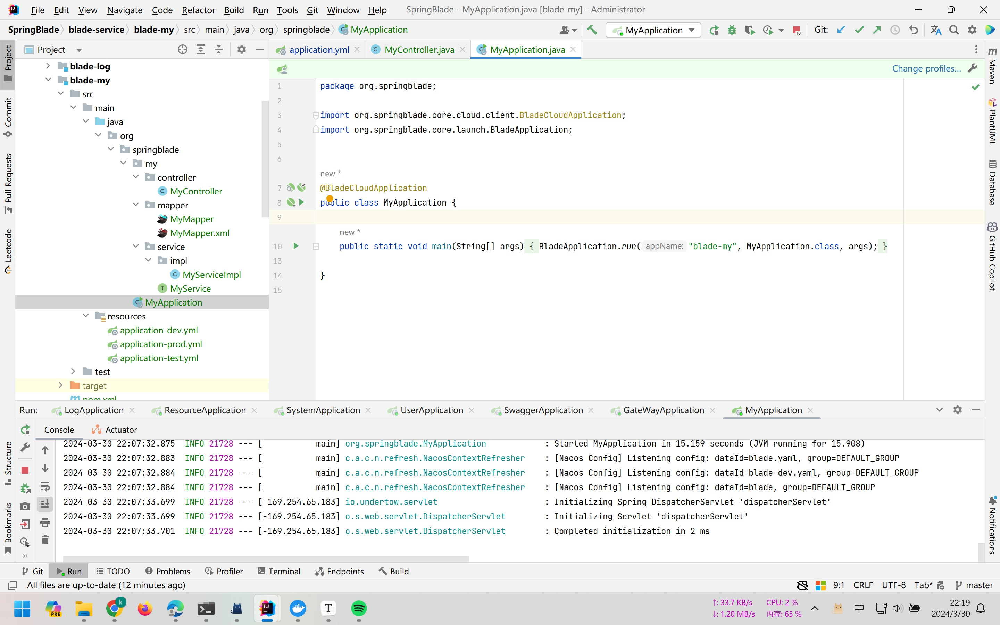

## 三、实现细节

> 1. blade-my 模块加入 Knife4j

导入依赖

```xml
<dependency>
    <groupId>org.springblade</groupId>
    <artifactId>blade-core-swagger</artifactId>
    <version>${blade.tool.version}</version>
</dependency>
```

配置 blade-swagger 模块

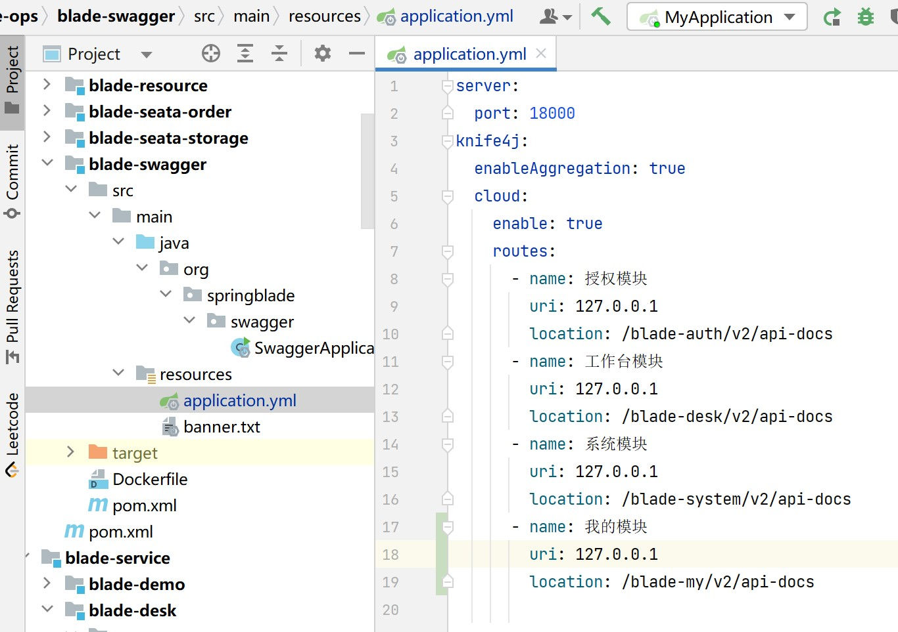

乱码 Bug

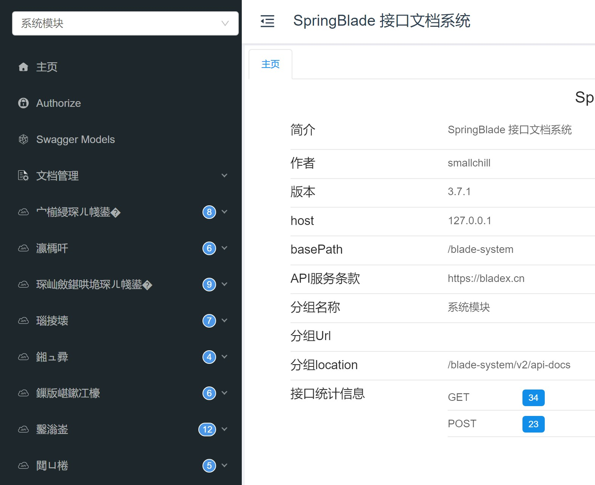

解决办法：在模块的 Controller 接口的 `@ApiOperation` 注解上添加参数 `produces = "application/octet-stream"`

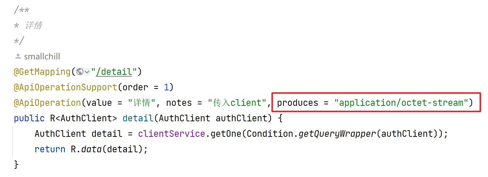

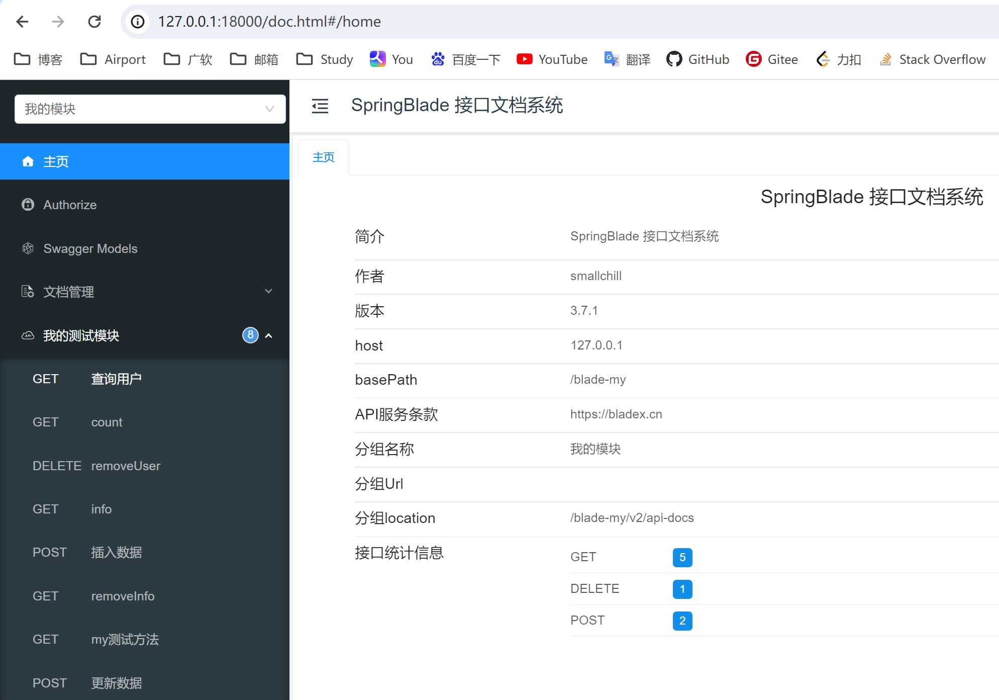

### 1. blade-my-api 模块

> 1. 创建实体类

```java
@Data
@NoArgsConstructor
@AllArgsConstructor
@Builder
@TableName("blade_my")
public class MyDO {
	/**
	 * 主键 id
	 */
	@TableId(type = IdType.AUTO)
	private Long id;
	/**
	 * 名字
	 */
	private String myName;
	/**
	 * 手机号码
	 */
	private String myPhone;
	/**
	 * 逻辑删除
	 */
	private boolean isDeleted;
	/**
	 * 创建时间
	 */
	private LocalDateTime createTime;
	/**
	 * 更新时间
	 */
	private LocalDateTime updateTime;
}
```

> 2. 设计请求类

```java
@Data
@NoArgsConstructor
@AllArgsConstructor
@Builder
@ApiModel(value = "更新信息 VO")
public class MyReqVO {
	@NotBlank(message = "名字不能为空")
	private String myName;

	@Pattern(regexp = "^(?:(?:\\+|00)86)?1[3-9]\\d{9}$", message = "手机号格式不正确")
	private String myPhone;

	@Past(message = "创建时间必须是过去的时间")
	private LocalDateTime createTime;
    
	@PastOrPresent(message = "更新时间必须是过去或当前时间")
	private LocalDateTime updateTime;
}
```

> 3. 设计响应类

```java
@Data
@AllArgsConstructor
@NoArgsConstructor
@Builder
public class MyRspVO {
	private String myName;
	private String myPhone;
	private LocalDateTime createTime;
	private LocalDateTime updateTime;
}
```

### 2. blade-my-api 模块

> 1. 配置 application.yaml

```xml
#服务器端口
server:
  port: 9101
#数据源配置
spring:
  datasource:
    url: ${blade.datasource.dev.url}
    username: ${blade.datasource.dev.username}
    password: ${blade.datasource.dev.password}
```

> 2. Controller 接口

```java
@RestController
@RequestMapping("my")
@Api(tags = "我的测试模块")
@Slf4j
@AllArgsConstructor
public class MyController {
	@Resource
	private final MyServiceImpl myService;
    
	@PostMapping("insert")
	@ApiOperation(value = "插入数据")
	public R insertUser(@Validated @RequestBody MyReqVO myReqVO) {
		return myService.insertUser(myReqVO);
	}

	@PostMapping("update")
	@ApiOperation(value = "更新数据")
	public R updateUser(Long id, @Validated @RequestBody MyReqVO myReqVO) {
		return myService.updateUser(id, myReqVO);
	}

	@GetMapping("check")
	@ApiOperation(value = "查询用户")
	public R insertUser(Long id) {
		return myService.selectUser(id);
	}

	@DeleteMapping("delete")
	public R removeUser(Long id) {
		return myService.removeUser(id);
	}
}
```

> 3. Service 业务

Service层使用 Mybatis Plus 

```java
public interface MyService extends IService<MyDO> {}
```

实现类 MyServiceImpl

```
@Service
public class MyServiceImpl extends ServiceImpl<MyMapper, MyDO> implements MyService {

	@Resource
	private MyMapper myMapper;

	/**
	 * 添加数据
	 * @param myReqVO
	 * @return
	 */
	public R insertUser(MyReqVO myReqVO) {
		// VO 转 DO
		MyDO myDO = MyDO.builder()
			.myName(myReqVO.getMyName())
			.myPhone(myReqVO.getMyPhone())
			.createTime(LocalDateTime.now())
			.updateTime(LocalDateTime.now())
			.build();
		boolean flag = save(myDO);
		return flag ? R.success("添加成功！") : R.fail("添加失败！");
	}

	/**
	 * 查找数据
	 * @param id
	 * @return
	 */
	public R selectUser(Long id) {
		MyDO myDO = myMapper.selectUserById(id);

		// DO 转 VO
		MyRspVO rspVO = MyRspVO.builder()
			.myName(myDO.getMyName())
			.myPhone(myDO.getMyPhone())
			.createTime(myDO.getCreateTime())
			.updateTime(myDO.getUpdateTime())
			.build();
		return R.data(rspVO);
	}

	/**
	 * 更新数据
	 * @param id
	 * @param myReqVO
	 * @return
	 */
	public R updateUser(Long id, MyReqVO myReqVO) {
		MyDO myDO = myMapper.selectUserById(id);
		if (Objects.isNull(myDO)) {
			return R.fail("该用户不存在！");
		}
		myDO = MyDO.builder()
			.id(id)
			.myName(myReqVO.getMyName())
			.myPhone(myReqVO.getMyPhone())
			.updateTime(LocalDateTime.now())
			.build();
		boolean flag = updateById(myDO);
		return flag ? R.success("更新成功！") : R.fail("更新失败！");
	}

	/**
	 * 删除数据
	 * @param id
	 * @return
	 */
	public R removeUser(Long id) {
		MyDO myDO = myMapper.selectUserById(id);
		if (Objects.isNull(myDO)) {
			return R.fail("该用户不存在,不用删除！");
		}
		// 若逻辑删除，只需设置 is_deleted 字段为 1
		// 实际删除
		int i = myMapper.removeUser(id);
		return i > 0 ? R.success("删除成功！") : R.fail("删除失败！");
	}
}
```

> 4. Mapper 数据持久

使用 JDK8 新特性接口默认方法查找用户

```java
public interface MyMapper extends BaseMapper<MyDO> {
	default MyDO selectUserById(Long id) {
		return selectOne(Wrappers.<MyDO>lambdaQuery().eq(MyDO::getId, id));
	}
	/**
	* 使用 xml 文件方式删除数据
	*/
	int removeUser(Long id);
}
```

MyMapper.xml

```xml
<!DOCTYPE mapper
    PUBLIC "-//mybatis.org//DTD Mapper 3.0//EN"
    "https://mybatis.org/dtd/mybatis-3-mapper.dtd">
<mapper namespace="org.springblade.my.mapper.MyMapper">
    <delete id="removeUser" parameterType="java.lang.Long">
        DELETE FROM blade.blade_my WHERE id = #{id}
    </delete>
</mapper>
```

## 四、测试结果

> 1. 获取认证 Token 

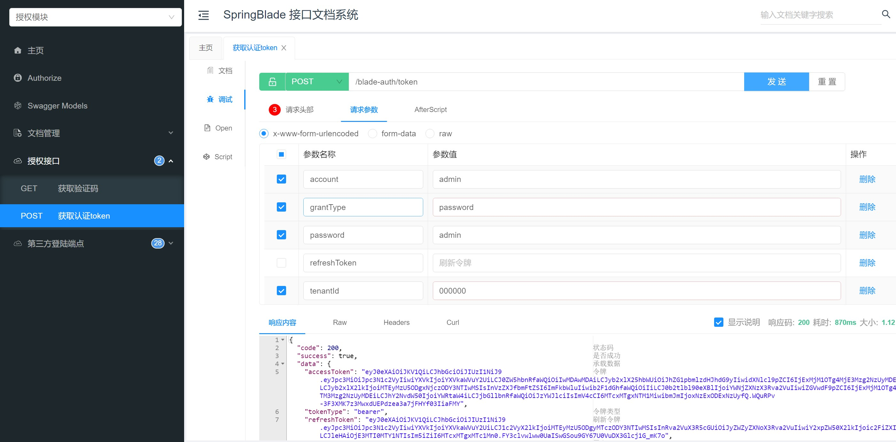

> 2. 设置全局请求头

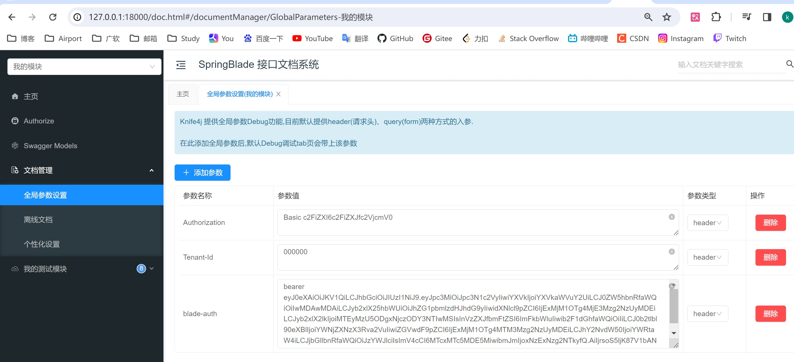

> 3. 插入数据

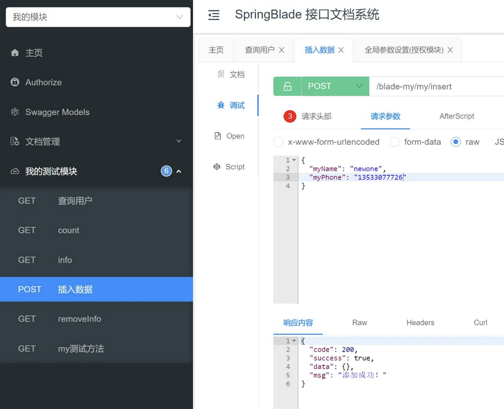

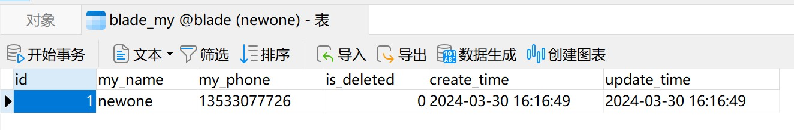

> 4. 查找数据

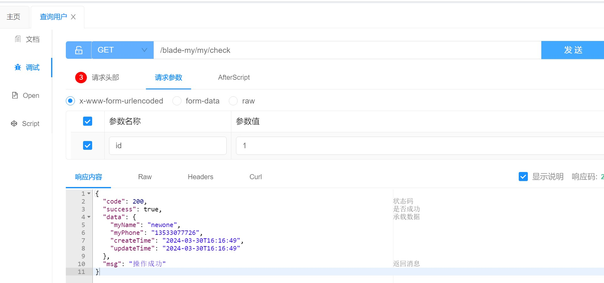

> 5. 更新数据

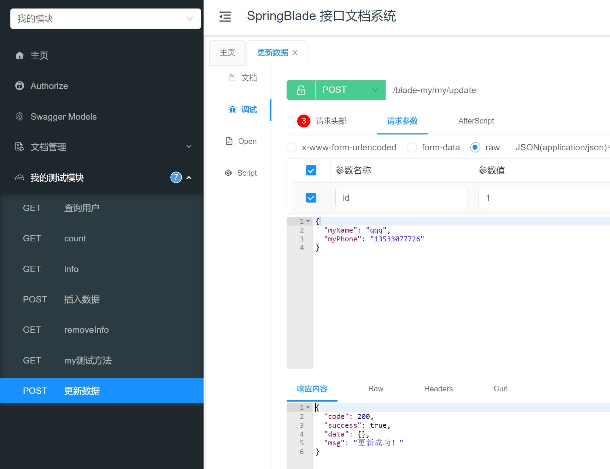

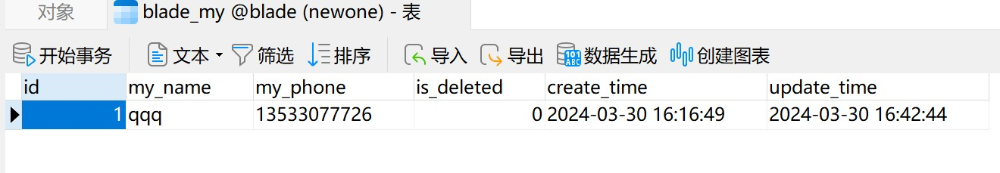

> 6. 删除数据

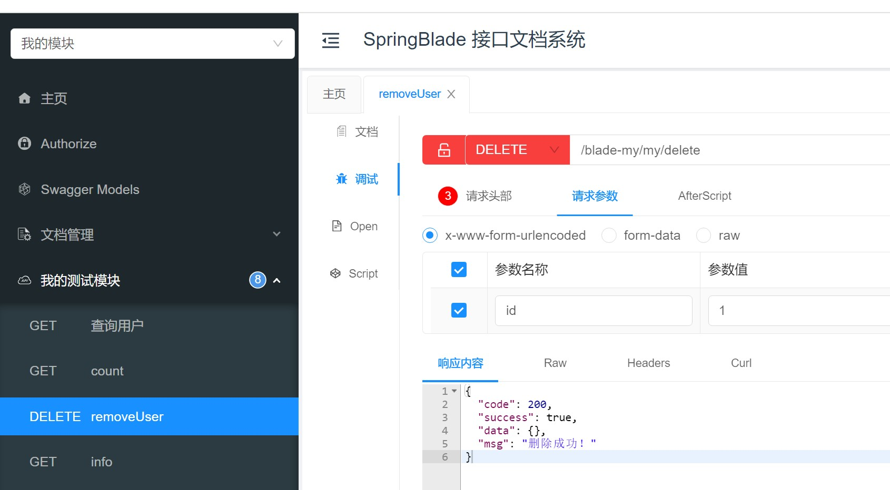

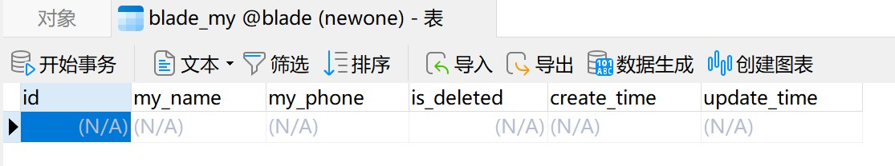