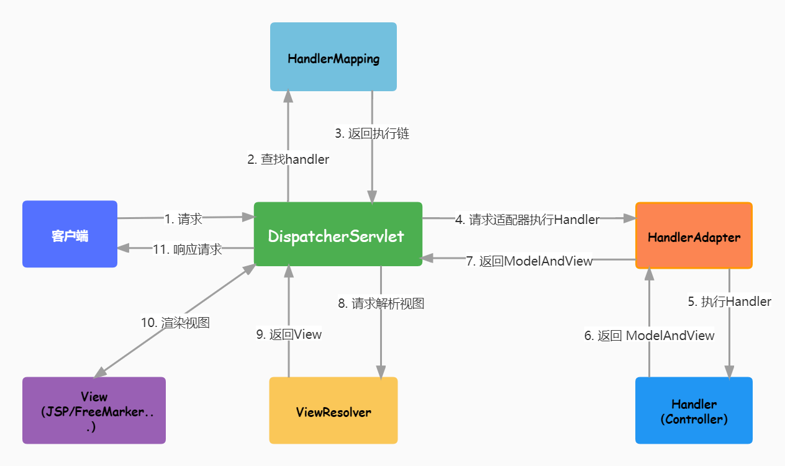

# SpringMVC笔记

## 1、什么是MVC

- MVC是模型(Model)、视图(View)、控制器(Controller)的简写。是一种软件设计规范。
- 主要作用是降低了**视图于业务逻辑间的双向耦合**

**Model(模型)：**数据模型，提供要展示的数据。包括数据和业务**(数据Dao和业务Service)**

**View(视图)：**负责进行模型的展示，即用户界面。

**Controller(控制器)：**接收用户请求，委托给模型进行处理，把处理完的模型数据返回给视图。控制器做了个调度员的工作。

## 2、什么是SpringMVC

**==SpringMVC是Spring Framework的一部分，是基于Java实现MVC的轻量级Web框架。==**

官方文档：https://docs.spring.io/spring/docs/5.2.0.RELEASE/spring-framework-reference/web.html#spring-web

特点：

1. 轻量级，简洁灵活，简单易学。
2. 高效，基于请求响应的MVC框架。
3. 于Spring兼容性好，无缝结合。
4. 约定优于配置。
5. 功能强大：RESTful、数据验证、格式化、本地化、主题等。

### 1、中心控制器(DispatchServlet)

- Spring的Web框架围绕DispatchServlet设计，DispatchServlet的作用是将请求分发到不同的处理器。
- SpringMVC与其他MVC框架一样，**以请求为驱动，围绕一个中心Servlet分派请求及提供其他功能，DispatchServlet是一个实际的Servlet(它继承自HttpServlet基类)。**


### 2、SpringMVC执行原理



1. DispatchServlet表示前置控制器，是SpringMVC的控制中心。用户发出请求，DispatchServlet接收请求并拦截。

   例：url为：http://localhost:8080/springmvc/hello 将url拆分为三部分：

   ​		http://localhost:8080	服务器域名

   ​		springmvc	部署在服务器上的web站点

   ​		hello	表示控制器

   ​		综上，url表示为：请求位于服务器localhost:8080上的springmvc站点的hello控制器。

2. HandlerMapping为处理器映射。DispatchServlet调用HandlerMapping,HandlerMapping根据请求url查找Handler。

3. HandlerAdapter表示处理器适配器，其按照特定的规则去执行Handler。

4. Handler让具体的Controller执行。

5. Controller将具体的执行信息返回给HandlerAdapter,如ModelAndView。

6. HandlerAdapter将视图逻辑名或模型传递给DispatchServlet。

7. DispatchServlet调用视图解析器(ViewResolver)来解析HandlerAdapter传递的逻辑视图名。

8. 视图解析器将解析的逻辑视图名传给DispatchServlet。

9. DispatchServlet根据视图解析器解析的试图结果，调用具体视图。

10. 最终视图呈现给用户。

## 3、第一个MVC程序

### 配置版

1. 使用Maven导入依赖

   ```xml
   <dependencies>
           <dependency>
               <groupId>org.springframework</groupId>
               <artifactId>spring-webmvc</artifactId>
               <version>5.2.0.RELEASE</version>
           </dependency>
           <dependency>
               <groupId>javax.servlet</groupId>
               <artifactId>servlet-api</artifactId>
               <version>2.5</version>
           </dependency>
           <dependency>
               <groupId>javax.servlet.jsp</groupId>
               <artifactId>jsp-api</artifactId>
               <version>2.2</version>
           </dependency>
           <dependency>
               <groupId>javax.servlet</groupId>
               <artifactId>jstl</artifactId>
               <version>1.2</version>
           </dependency>
   </dependencies>
   ```

2. 配置web.xml，注册DispatchServlet

   ```xml
   <?xml version="1.0" encoding="UTF-8"?>
   <web-app xmlns="http://xmlns.jcp.org/xml/ns/javaee"
           xmlns:xsi="http://www.w3.org/2001/XMLSchema-instance"
           xsi:schemaLocation="http://xmlns.jcp.org/xml/ns/javaee http://xmlns.jcp.org/xml/ns/javaee/web-app_4_0.xsd"
           version="4.0">
   
      <!--1.注册DispatcherServlet-->
      <servlet>
          <servlet-name>springmvc</servlet-name>
          <servlet-class>org.springframework.web.servlet.DispatcherServlet</servlet-class>
          <!--关联一个springmvc的配置文件:【servlet-name】-servlet.xml-->
          <init-param>
              <param-name>contextConfigLocation</param-name>
              <param-value>classpath:springmvc-servlet.xml</param-value>
          </init-param>
          <!--启动级别-1-->
          <load-on-startup>1</load-on-startup>
      </servlet>
       
      <!--/ 匹配所有的请求；（不包括.jsp）-->
      <!--/* 匹配所有的请求；（包括.jsp）-->
      <servlet-mapping>
          <servlet-name>springmvc</servlet-name>
          <url-pattern>/</url-pattern>
      </servlet-mapping>
       
   </web-app>
   ```

3. 编写SpringMVC配置文件，名称：spingmvc-servlet.xml

   ```xml
   <?xml version="1.0" encoding="UTF-8"?>
   <beans xmlns="http://www.springframework.org/schema/beans"
          xmlns:xsi="http://www.w3.org/2001/XMLSchema-instance"
          xsi:schemaLocation="http://www.springframework.org/schema/beans
          http://www.springframework.org/schema/beans/spring-beans.xsd">
       <!--处理器映射器-->
       <bean class="org.springframework.web.servlet.handler.BeanNameUrlHandlerMapping"/>
       <!--处理器适配器-->
       <bean class="org.springframework.web.servlet.mvc.SimpleControllerHandlerAdapter"/>
   
       <!--视图解析器：DispatcherServlet给它ModelAndView-->
       <bean class="org.springframework.web.servlet.view.InternalResourceViewResolver" id="InternalResourceViewResolver">
           <!--前缀-->
           <property name="prefix" value="/WEB-INF/jsp/"/>
           <!--后缀-->
           <property name="suffix" value=".jsp"/>
       </bean>
   
       <!--将自己的类交给SpringIOC容器，注册bean-->
       <!--Handler：BeanNameUrlHandlerMapping需要配置-->
       <bean id="/hello" class="com.kuang.controller.HelloController"/>
   
   </beans>
   ```

4. 编写操作业务Controller，实现Controller接口或添加注解，返回一个ModelAndView。

   ```java
   //注意：这里我们先导入Controller接口
   public class HelloController implements Controller {
      public ModelAndView handleRequest(HttpServletRequest request, HttpServletResponse response) throws Exception {
          //ModelAndView 模型和视图
          ModelAndView mv = new ModelAndView();
   
          //业务代码...
          
          //封装对象，放在ModelAndView中。Model
          mv.addObject("msg","HelloSpringMVC!");
          //封装要跳转的视图，放在ModelAndView中
          mv.setViewName("hello"); //: /WEB-INF/jsp/hello.jsp
          return mv;
     }  
   }
   ```

   5.编写jsp页面，显示ModelAndView，以及正常页面。

   ```jsp
   <%@ page contentType="text/html;charset=UTF-8" language="java" %>
   <html>
   	<head>
      		<title>Kuangshen</title>
   	</head>
   	<body>
   		${msg}
   	</body>
   </html>
   ```

   6.启动Tomcat

   

### 注解版

更改上述示例的controller和springmvc-servlet.xml配置文件。

1. 添加Spring MVC配置文件

   ```xml
   <?xml version="1.0" encoding="UTF-8"?>
   <beans xmlns="http://www.springframework.org/schema/beans"
         xmlns:xsi="http://www.w3.org/2001/XMLSchema-instance"
         xmlns:context="http://www.springframework.org/schema/context"
         xmlns:mvc="http://www.springframework.org/schema/mvc"
         xsi:schemaLocation="http://www.springframework.org/schema/beans
          http://www.springframework.org/schema/beans/spring-beans.xsd
          http://www.springframework.org/schema/context
          https://www.springframework.org/schema/context/spring-context.xsd
          http://www.springframework.org/schema/mvc
          https://www.springframework.org/schema/mvc/spring-mvc.xsd">
   
      <!-- 自动扫描包，让指定包下的注解生效,由IOC容器统一管理 -->
      <context:component-scan base-package="com.kuang.controller"/>
      <!-- 让Spring MVC不处理静态资源 -->
      <mvc:default-servlet-handler />
      <!--
      支持mvc注解驱动
          在spring中一般采用@RequestMapping注解来完成映射关系
          要想使@RequestMapping注解生效
          必须向上下文中注册DefaultAnnotationHandlerMapping
          和一个AnnotationMethodHandlerAdapter实例
          这两个实例分别在类级别和方法级别处理。
          而annotation-driven配置帮助我们自动完成上述两个实例的注入。
       -->
      <mvc:annotation-driven />
   
      <!-- 视图解析器 -->
      <bean class="org.springframework.web.servlet.view.InternalResourceViewResolver"
            id="internalResourceViewResolver">
          <!-- 前缀 -->
          <property name="prefix" value="/WEB-INF/jsp/" />
          <!-- 后缀 -->
          <property name="suffix" value=".jsp" />
      </bean>
   
   </beans>
   ```

2. 创建Controller

   ```java
   @Controller
   @RequestMapping("/HelloController")
   public class HelloController {
   
      //真实访问地址 : 项目名/HelloController/hello
      @RequestMapping("/hello")
      public String sayHello(Model model){
          //向模型中添加属性msg与值，可以在JSP页面中取出并渲染
          model.addAttribute("msg","hello,SpringMVC");
          //web-inf/jsp/hello.jsp
          return "hello";
     }
   }
   ```

   3.运行

   

小结：

使用SpringMVC必须配置的三大件：

==处理器映射器(HandlerMapping)、处理器适配器(HandlerAdapter)、视图解析器(ViewResolver)==

通常，只需要手动配置**视图解析器**，而**处理器映射器**和**处理器适配器**只需要开启**注解驱动**即可。

## 4、控制器Controller

- 控制器提供访问应用程序的行为，通过实现接口或注解两种方式实现。
- 控制器负责解析用户的请求并将其转换为一个模型
- SpringMVC中一个控制器可以包含多个方法

### 实现接口

1. Controller类

   ```java
   public class ControllerTest1 implements Controller {
   
      public ModelAndView handleRequest(HttpServletRequest httpServletRequest, HttpServletResponse httpServletResponse) throws Exception {
          //返回一个模型视图对象
          ModelAndView mv = new ModelAndView();
          mv.addObject("msg","Test1Controller");
          mv.setViewName("test");
          return mv;
     }
   }
   ```

2. Spring配置文件中注册请求的bean，name对应请求路径，class对应处理请求的类

   ```xml
   <bean name="/t1" class="com.kuang.controller.ControllerTest1"/>
   ```

### 注解@Controller

1. Controller类

   ```java
   //@Controller注解的类会自动添加到Spring上下文中
   @Controller
   public class ControllerTest2{
   
      //映射访问路径
      @RequestMapping("/t2")
      public String index(Model model){
          //Spring MVC会自动实例化一个Model对象用于向视图中传值
          model.addAttribute("msg", "ControllerTest2");
          //返回视图位置
          return "test";
     }
   }
   ```

   2.springmvc-servlet.xml

   ```xml
   <!-- 自动扫描指定的包，下面所有注解类交给IOC容器管理 -->
   <context:component-scan base-package="com.kuang.controller"/>
   ```

### RequestMapping

@**RequestMapping**

- @RequestMapping注解用于映射url到控制器类或一个特定的处理程序方法。作用于类或方法上。

- 只作用于方法上，访问路径：http://localhost:8080 / 项目名 / h1

  ```java
  @Controller
  public class TestController {
     @RequestMapping("/h1")
     public String test(){
         return "test";
    }
  }
  ```

- 同时注解类与方法，访问路径：http://localhost:8080 / 项目名/ admin /h1

  ```java
  @Controller
  @RequestMapping("/admin")
  public class TestController {
     @RequestMapping("/h1")
     public String test(){
         return "test";
    }
  }
  ```

## 5、RestFul风格

**概念**

RestFul是一个资源定位及资源操作的风格。不是标准也不是协议，只是一种风格。基于这种分格设计的软件可以更简洁，更有层次，更易于实现缓存等机制。

**功能**

资源：互联网所有的事物都可以被抽象为资源

资源操作：使用POST、DELETE、PUT、GET，使用不同方法对资源进行操作。

分别对应 添加、 删除、修改、查询。

**传统方式操作资源**  ：通过不同的参数来实现不同的效果！方法单一，post 和 get

​	http://127.0.0.1/item/queryItem.action?id=1 查询,GET

​	http://127.0.0.1/item/saveItem.action 新增,POST

​	http://127.0.0.1/item/updateItem.action 更新,POST

​	http://127.0.0.1/item/deleteItem.action?id=1 删除,GET或POST

**使用RESTful操作资源** ：可以通过不同的请求方式来实现不同的效果！如下：请求地址一样，但是功能可以不同！

​	http://127.0.0.1/item/1 查询,GET

​	http://127.0.0.1/item 新增,POST

​	http://127.0.0.1/item 更新,PUT

​	http://127.0.0.1/item/1 删除,DELETE

**使用**

1. Controller类，**@PathVariable 注解**，让方法参数的值对应绑定到一个URI模板变量上。

   url:http://localhost:8080/springmvc/commit/1/2

   ```java
   @Controller
   public class RestFulController {
      //映射访问路径
      @RequestMapping("/commit/{p1}/{p2}")
      public String index(@PathVariable int p1, @PathVariable int p2, Model model){
          int result = p1+p2;
          //Spring MVC会自动实例化一个Model对象用于向视图中传值
          model.addAttribute("msg", "结果："+result);
          //返回视图位置
          return "test";
     }
   }
   ```

2. 使用**method属性**指定请求类型

   用于约束请求的类型，收窄请求范围。指定请求谓词的类型如GET, POST, HEAD, OPTIONS, PUT, PATCH, DELETE, TRACE等

   ```java
   //映射访问路径,必须是POST请求
   @RequestMapping(value = "/hello",method = {RequestMethod.GET})
   public String index2(Model model){
      model.addAttribute("msg", "hello!");
      return "test";
   }
   ```

**小结：**

Spring MVC 的 @RequestMapping 注解能够处理 HTTP 请求的方法, 比如 GET, PUT, POST, DELETE 以及 PATCH。

**所有的地址栏请求默认都会是 HTTP GET 类型的。**

方法级别的注解变体有如下几个：组合注解

```java
@GetMapping
@PostMapping
@PutMapping
@DeleteMapping
@PatchMapping
```

@GetMapping 是一个组合注解，平时使用的会比较多！

它所扮演的是 @RequestMapping(method =RequestMethod.GET) 的一个快捷方式。